PE文件是Windows操作系统下使用的可执行文件格式。

PE文件是指32位的可执行文件，也称为PE32，64位的可执行文件称为PE+或PE32+，是PE（PE32）文件的一种扩展形式（请注意不是PE64）

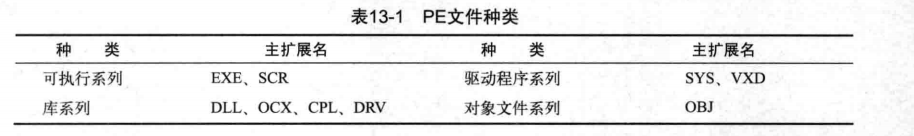

### 基本结构

从DOS头（DOS header ）到节区头（Section header）是PE头部分，其下的节区合称PE体。文件中使用偏移（offset），内存中使用VA （Virtual Address，虚拟地址）来表示位置。文件加载到内存时，情况就会发生变化（节区的大小、位置等）。文件的内容一般可分为代码（.text）、数据（.data）、资源（.rsrc）节，分别保存。

PE头与各节区的尾部存在一个区域，称为NULL填充（NULL padding）。

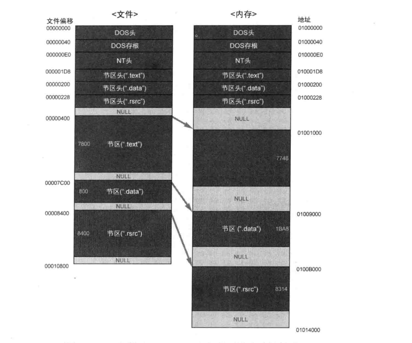

### VA&RVA

VA指的是进程虚拟内存的绝对地址， RVA （ Relative Virtual Address，相对虚拟地址）指从某个基准位置（ImageBase ）开始的相对地址。VA与RVA满足下面的换算关系。

#### RVA+ImageBase=VA

#### RVA = VA - ImageBase

#### 提示

32位Windows OS中，各进程分配有4GB的虚拟内存，因此进程中VA值的范围是00000000-FFFFFFFF。

### DOS 头

#### IMAGE_DOS_HEADER结构体

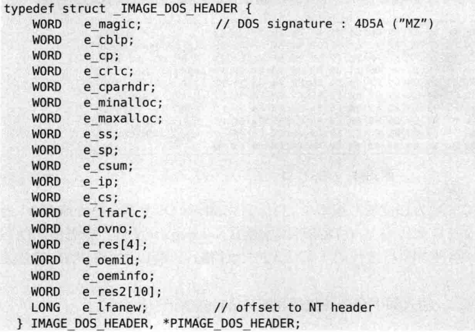

IMAGE_DOS_HEADER结构体的大小为40个字节。

2个重要成员：e_magic与e_lfanew。

e-magic：DOS签名（signature，4D5A=>ASCII值"MZ"）。
e_lfanew：指示NT头的偏移（根据不同文件拥有可变值）。

### NT 头

#### NT头IMAGE_NT_HEADERS。

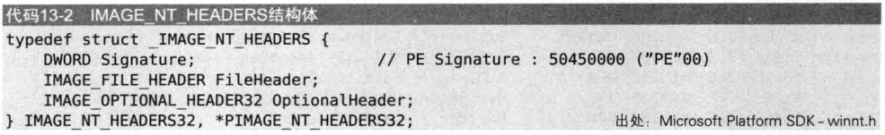

IMAGE_NT_HEADERS结构体由3个成员组成，

第一个成员为签名（Signature）结构体，其值为50450000h（"PE"00）。

另外两个成员分别为文件头（File Header）与可选头（Optional Header）结构体。

IMAGE_NT_HEADERS结构体的大小为F8

### 文件头

文件头是表现文件大致属性的IMAGE_FILE_HEADER结构体。

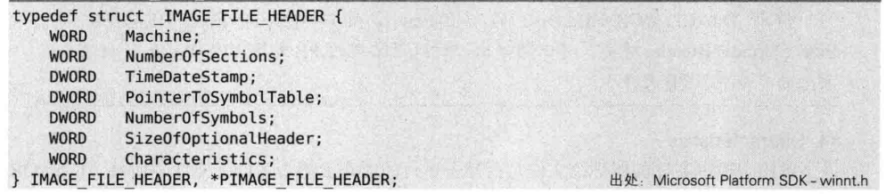

IMAGE_FILE_HEADERS结构体中有如下4个重要成员（若它们设置不正确，将导致文件无法正常运行）。

#1.Machine

每个CPU都拥有唯一的Machine码，兼容32位Intel x86芯片的Machine码为14C，以下是定义在winnt.h文件中的Machine码。

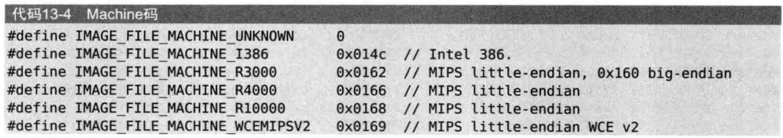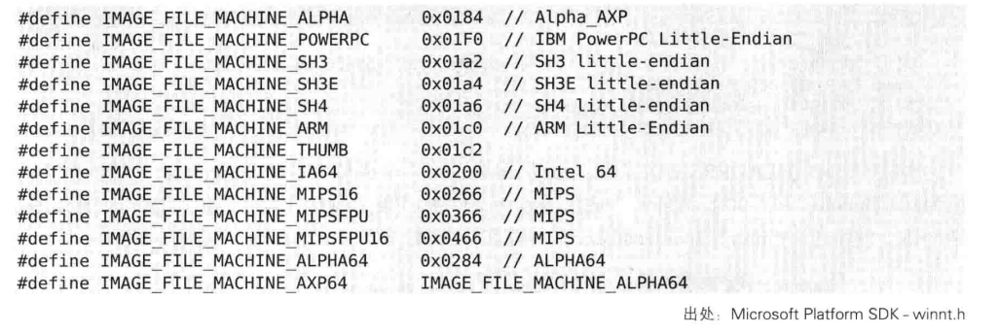

#2.NumberOfSections
NumberOfSections用来指出文件中存在的节区数量。该值一定要大于0，且当定义的节区数量与实际节区不同时，将发生运行错误。

#3.SizeOfOptionalHeader

SizeOfOptionalHeader成员用来指出IMAGE_OPTIONAL_HEADER32或IMAGE_OPTIONAL_HEADER64结构体的长度。

#4.Characteristics

该字段用于标识文件的属性，文件是否是可运行的形态、是否为DLL文件等信息，以bit OR形式组合起来。
以下是定义在winnt.h文件中的Characteristics值（请记住0002h与2000h这两个值）。

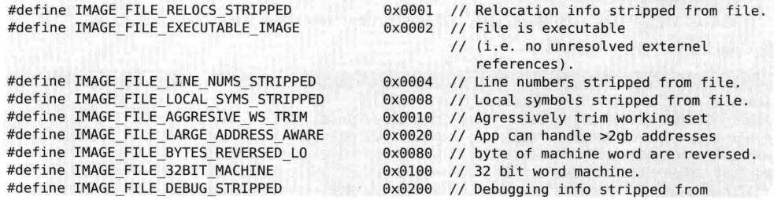

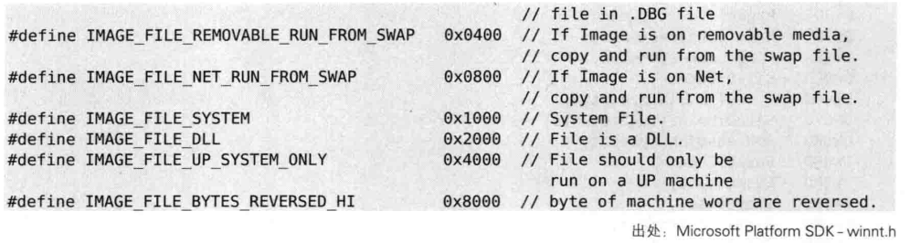

IMAGE_FILE_HEADER的TimeDateStamp成员。该成员的值不影响文件运行，用来记录编译器创建此文件的时间。

### 可选头

IMAGE_OPTIONAL_HEADER32是PE头结构体中最大的。

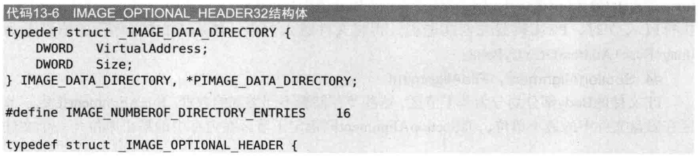

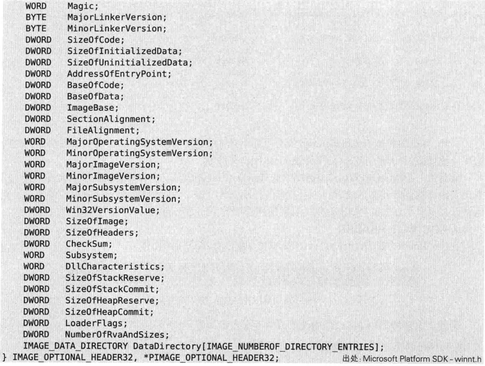

下面这些值是文件运行必需的，设置错误将导致文件无法正常运行。

#### #1.Magic

为IMAGE_OPTIONAL_HEADER32结构体时，Magic码为10B；为IMAGE_OPTIONAL_
HEADER64结构体时，Magic码为20B。

##### #2.AddressOfEntryPoint

AddressOfEntryPoint持有EP的RVA值。该值指出程序最先执行的代码起始地址，相当重要。

##### #3.ImageBase

进程虚拟内存的范围是0-FFFFFFFF（32位系统）。PE文件被加载到如此大的内存中时，ImageBase指出文件的优先装入地址。
EXE、DLL文件被装载到用户内存的0-7FFFFFFF中，SYS文件被载入内核内存的80000000-FFFFFFFF中。一般而言，使用开发工具（VB/VC++/Delphi）创建好EXE文件后，其ImageBase的值为00400000，DLL文件的ImageBase值为10000000（当然也可以指定为其他值）。
执行PE文件时，PE装载器先创建进程，再将文件载入内存，然后把EIP寄存器的值设置为ImageBase+AddressOfEntryPoint。

##### #4.SectionAlignment，FileAlignment 

FileAlignment指定了节区在磁盘文件中的最小单位，而SectionAlignment则指定了节区在内存中的最小单位（一个文件中，FileAlignment与SectionAlignment的值可能相同，也可能不同）。磁盘文件或内存的节区大小必定为FileAlignment或SectionAlignment值的整数倍。

##### #5.SizeOflmage

加载PE文件到内存时，SizeOfImage指定了PE Image在虚拟内存中所占空间的大小。

它表示PE文件加载到内存时占用的虚拟内存空间的总大小。

该大小是从**ImageBase**（PE文件加载的基地址）开始，涵盖文件所有加载到内存的部分，包括所有节（Sections）以及对齐到内存页的额外空间。

##### #6.SizeOfHeader

SizeOfHeader用来指出整个PE头的大小。该值也必须是FileAlignment的整数倍。

##### #7.Subsystem

该Subsystem值用来区分系统驱动文件（*.sys）与普通的可执行文件（*.exe，*.dll）。

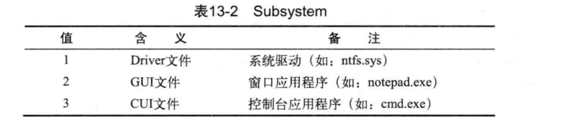

##### #8.NumberOfRvaAndSizes

 NumberOfRvaAndSizes用来指定DataDirectory（IMAGE_OPTIONAL_HEADER32结构体的最后一个成员）数组的个数。

#9.DataDirectory 

DataDirectory是由IMAGE_DATA_DIRECTORY结构体组成的数组，数组的每项都有被定义的值。

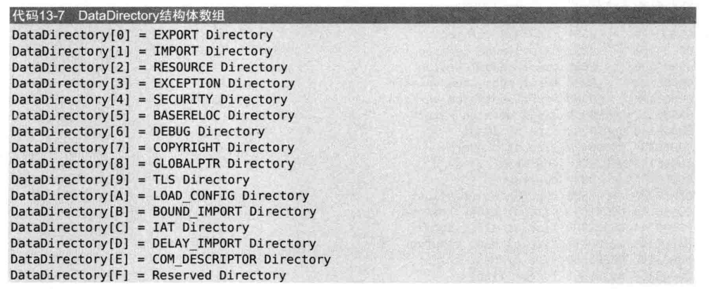

##### **计算 `DataDirectory` 的偏移**

- 在可选头中：
  - 如果是 32 位文件，`IMAGE_OPTIONAL_HEADER32` 的 `DataDirectory` 起始位置是结构体的第 96 字节处。
  - 如果是 64 位文件，`IMAGE_OPTIONAL_HEADER64` 的 `DataDirectory` 起始位置是结构体的第 112 字节处。

### 节区头

节区头中定义了各节区属性。

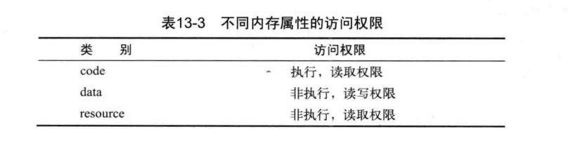

IMAGE_SECTION_HEADER节区头是由IMAGE_SECTION_HEADER结构体组成的数组，每个结构体对应一个节区。

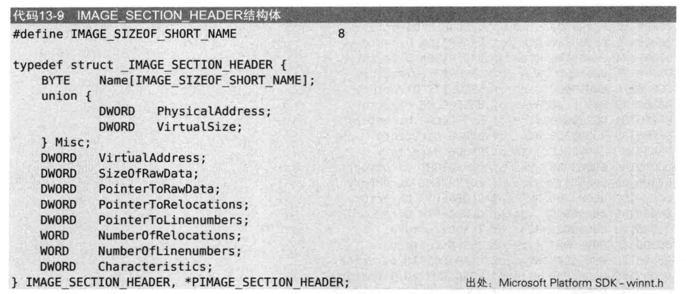

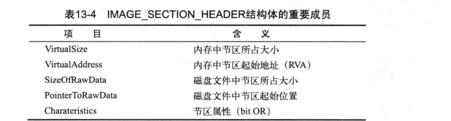

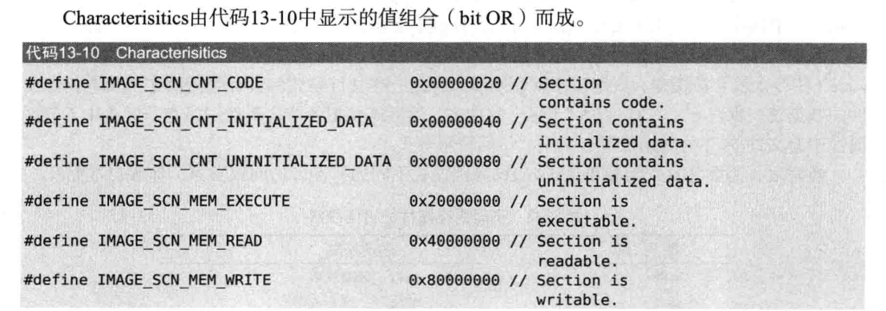

Name成员不像C语言中的字符串一样以NULL结束，并且没有“必须使用ASCII值”的限制。

### RVA to RAW

PE文件加载到内存时，每个节区都要能准确完成内存地址与文件偏移间的映射。这种映射一般称为RVA to RAW，方法如下。
（1）查找RVA所在节区。
（2）使用简单的公式计算文件偏移（RAW）。
根据IMAGE_SECTION_HEADER结构体，换算公式如下：

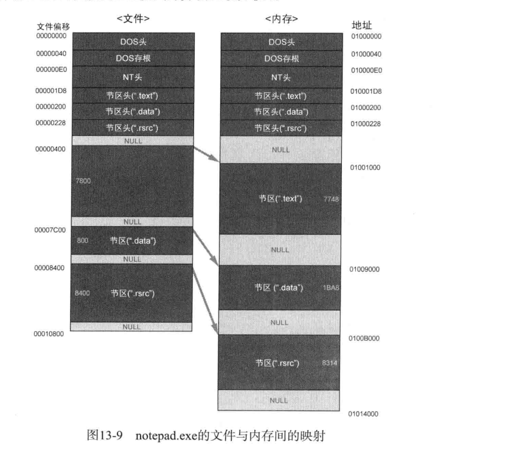

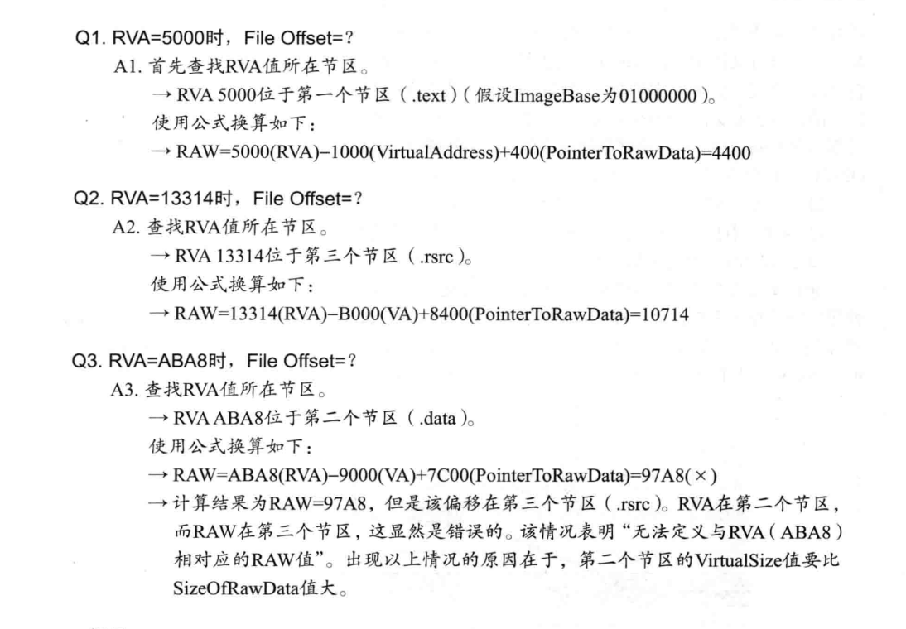

###  IAT

IAT（Import Address Table，导入地址表）。

IAT是一种表格，用来记录程序正在使用哪些库中的哪些函数。

### DLL

DLL（Dynamic Linked Library）

DLL翻译成中文为“动态链接库”

DLL文件的ImageBase值一般为10000000。

加载DLL的方式实际有两种：一种是“显式链接”（Explicit Linking），程序使用DLL时加载，使用完毕后释放内存；另一种是“隐式链接”（Implicit Linking），程序开始时即一同加载DLL，程序终止时再释放占用的内存。

IAT提供的机制即与隐式链接有关。

实际操作中无法保证DLL一定会被加载到PE头内指定的ImageBase处。但是EXE文件（生成进程的主体）却能准确加载到自身的ImageBase中，因为它拥有自已的虚拟空间。

### IMAGE_IMPORT_DESCRIPTOR

IMAGE_IMPORT_DESCRIPTOR结构体中记录着PE文件要导入哪些库文件。

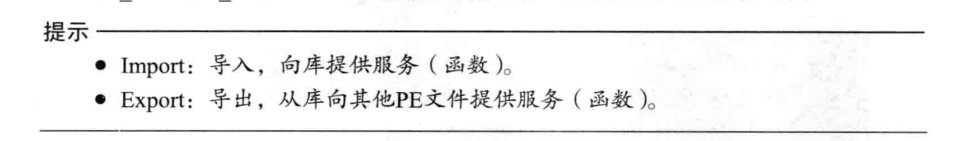

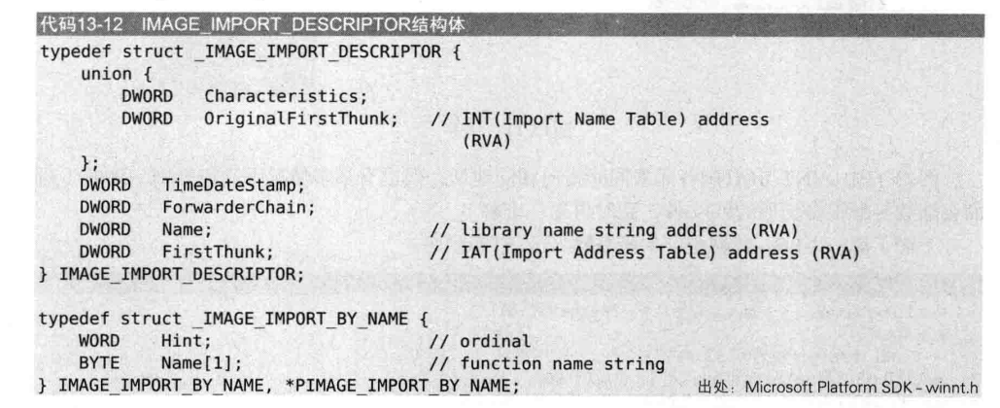

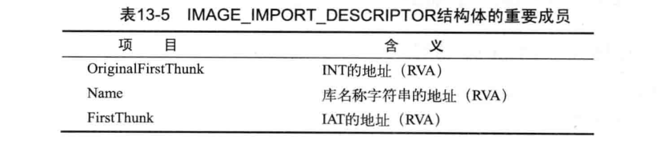

执行一个普通程序时往往需要导入多个库，导入多少库就存在多少个IMAGE_IMPORT_DESCRIPTOR结构体，这些结构体形成了数组，且结构体数组最后以NULL结构体结束。

PE头中提到的“Table”即指数组。
INT与IAT是长整型（4个字节数据类型）数组，以NULL结束（未另外明确指出大小）。
INT中各元素的值为IMAGE_IMPORT_BY_NAME结构体指针（有时IAT也拥有相同的值）。
INT与IAT的大小应相同。

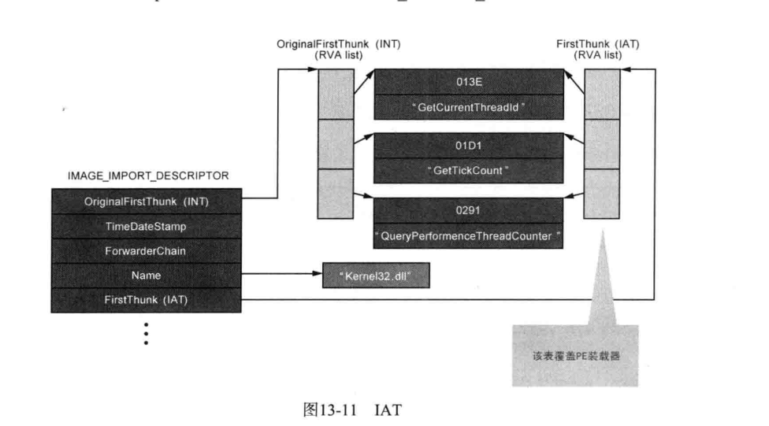

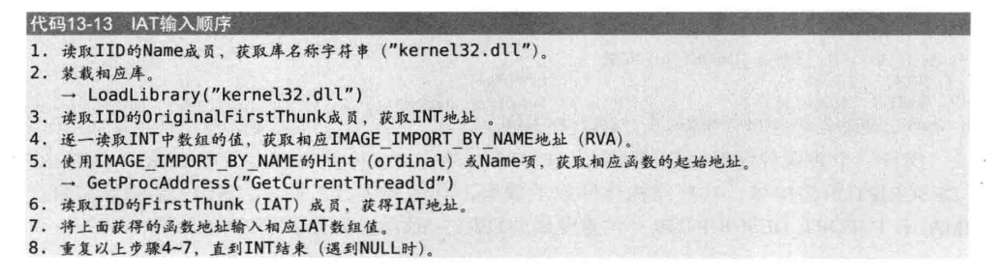

IMAGE_IMPORT_DESCRIPTOR结构体数组位于IMAGE-OPTIONAL_HEADER32.DataDirectory[1].VirtualAddress的值即是IMAGE_IMPORT_DESCRIPTOR结构体数组的起始地址（RVA值），IMAGE_IMPORT_DESCRIPTOR结构体数组也被称为IMPORT Directory Table（了解上述全部称谓，与他人交流时才能没有障碍）。

IMAGE_OPTIONAL_HEADER32.DataDirectory[1]结构体的值如图13-12所示（第一个4字节为虚拟地址，第二个4字节为Size成员）。

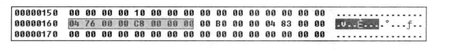

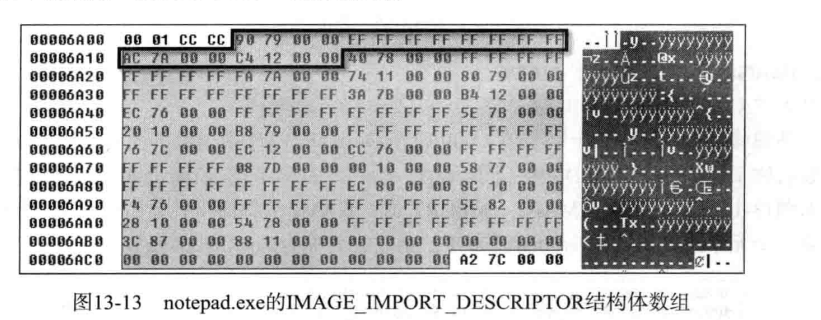

阴影部分即为全部的IMAGE_IMPORT_DESCRIPTOR结构体数组，粗线框内的部分是结构体数组的第一个元素（也可以看到数组的最后是由NULL结构体组成的）。

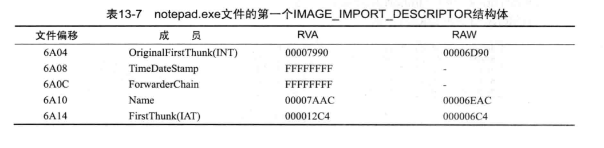

##### 1.库名称（Name）

Name是一个字符串指针，它指向导入函数所属的库文件名称。

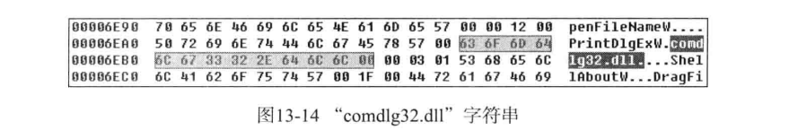

##### 2.OriginalFirstThunk-INT 

INT是一个包含导入函数信息（Ordinal，Name）的结构体指针数组。只有获得了这些信息，才能在加载到进程内存的库中准确求得相应函数的起始地址

INT由地址数组形式组成（数组尾部以NULL结束）。每个地址值分别指向IMAGE_IMPORT_BY_NAME结构体

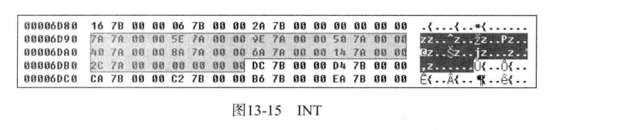 

##### 3.IMAGE_IMPORT_BY_NAME

文件偏移6E7A最初的2个字节值（000F）为Ordinal，是库中函数的固有编号。Ordinal的后面为函数名称字符串PageSetupDigW（同C语言一样，字符串末尾以`'\0'`结束）。

数组的第一个元素指向函数的Ordinal值000F，函数的名称为PageSetupDigW。

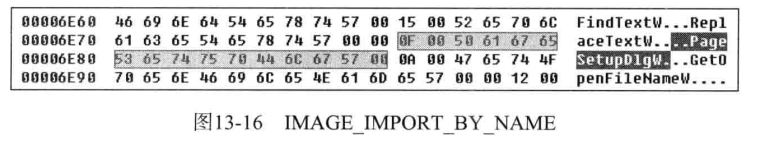

##### 4. FirstThunk -IAT (Import Address Table)

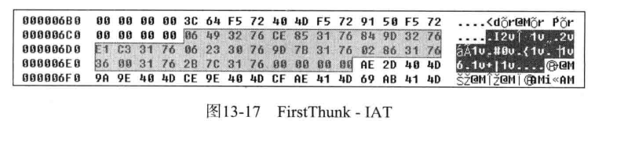

文件偏移6C4-6EB区域即为IAT数组区域，对应于comdlg32.d11库。它与INT类似，由结构体指针数组组成，且以NULL结尾。
IAT的第一个元素值被硬编码为76324906，该值无实际意义，notepad.exe文件加载到内存时，准确的地址值会取代该值。

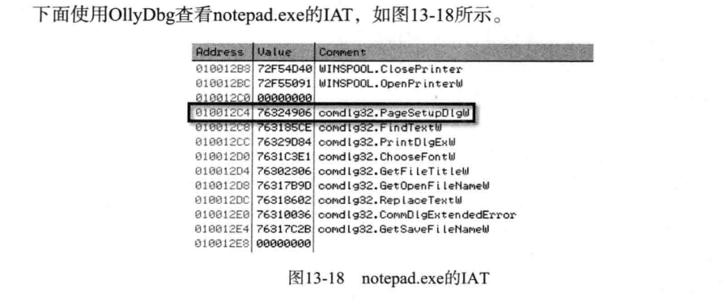

notepad.exe的ImageBase值为01000000。所以comdlg32.dll!PageSetupDlgW函数的IAT地址为010012C4，其值为76324906，它是API准确的起始地址值。

进入76324906地址中

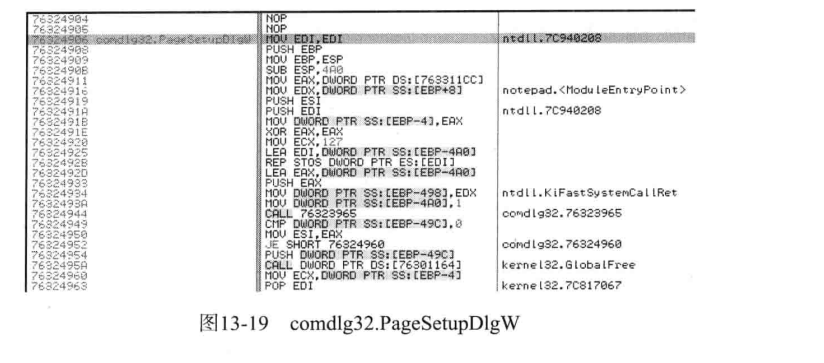