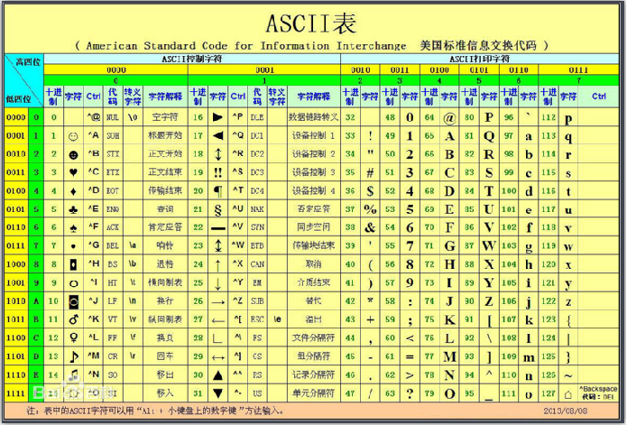
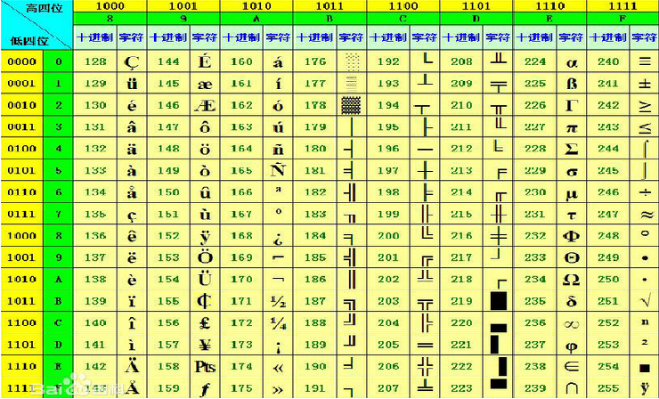

# 字符编码

### 标准的ASCII码

范围是0-127




### ASCII码的拓展

范围是128-255




### GB2312或GB2312-80

这两个编码是由两张ASCII码的拓展的编码组成

也就是说两个字节表示一个中文

字节1的范围是 128-255

字节2的范围是 128-255


### UNICODE编码


UNICODE编码包含全世界所有文字的一个编码表


Unicode编码范围是：0-0x10FFFF，可以容纳100多万个符号!

Unicode只是一个符号集，它只规定了符号的二进制代码，却没有规定这个二进制代码应该如何存储。


### 如何存储UNICODE

#### UTF-16

​	UTF-16编码以16位无符号整数为单位，注意是16位为一个单位，不表示一个字符就只有16位。这个要看字符的unicode编码处于什么范围而定，有可能是2个字节，也可能是4个字节现在机器上的unicode编码一般指的就是UTF-16

意思是utf-16是以两个字节来划分字符编码的,假如一个字符需要4个字节来表示,UTF-16形式存储会将4字节中的前两个字节编码和后两个字节编码分别存放.


#### UTF-8：

```
Unicode编码(16进制)　	║　UTF-8 字节流(二进制) 　
000000 - 00007F　	║　0xxxxxxx 　　
000080 - 0007FF　	║　110xxxxx 10xxxxxx 　　
000800 - 00FFFF　	║　1110xxxx 10xxxxxx 10xxxxxx 　　
010000 - 10FFFF　	║　11110xxx 10xxxxxx 10xxxxxx 10xxxxxx 

```

000000 - 00007F　范围用1个字节存放

000080 - 0007FF   范围用2个字节存放

000800 - 00FFFF	范围用3个字节存放

010000 - 10FFFF　范围用4个字节存放


#### BOM(Byte Order Mark)：

UTF-8 编码存放的文件十六进制开头是EF BB BF 　

UTF-16LE  	UTF-16小端存放开头是　	FF FE 　　
UTF-16BE  	UTF-16大端存放开头　	FE FF 　

```
UTF-8　    	║　	EF BB BF 　　
UTF-16LE  	║　	FF FE 　　
UTF-16BE  	║　	FE FF 　
```


# C语言中的宽字符

```
char szStr[] = "中国";

wchar_t swzStr[] = L"中国";

```

如果字符串前面不加L,默认是以IDE项目设置的字符集形式，可能是ASCII码

字符串前面加上L，表示用UNICODE字符集存放

wchar_t是宽字符类型，两个字节


### 打印宽字符

```
#include <locale.h>		//要包含这个头文件

setlocale(LC_ALL,"");//使用控制台默认的编码

wchar_t swzStr[] = L“中国”;

wprintf(L"%s\n",x1);

```


### 字符串长度

```
char szStr[] = "中国";								
wchar_t swzStr[] = L"中国";								
strlen(szStr);	//取得多字节字符串中字符长度，不包含 00										
wcslen(swzStr);	//取得多字节字符串中字符长度，不包含 00 00
```


### 常用函数

```
char		wchar_t		//多字节字符类型   宽字符类型									
printf		wprintf		//打印到控制台函数									
strlen		wcslen		//获取长度			
							
strcpy		wcscpy		//字符串复制			
							
strcat		wcscat		//字符串拼接			
							
strcmp		wcscmp		//字符串比较			
							
strstr		wcsstr		//字符串查找	

```


# Win32  API中的宽字符

### 什么是Win32 API? 有哪些? 在哪里? 

主要是存放在 C:\WINDOWS\system32 下面所有的dll

如果是64位系统，system32存放的是64位的DLL，SysWOW64存放的是32位的DLL


几个重要的DLL：

<1> Kernel32.dll：最核心的功能模块，比如管理内存、进程和线程相关的函数等。

<2> User32.dll：是Windows用户界面相关应用程序接口,如创建窗口和发送消息等。

<3> GDI32.dll：全称是Graphical Device Interface(图形设备接口),包含用于画图和显示文本的函数。


### 常用数据类型：

```
汇编：
	byte 		BYTE		PBYTE
	word		WORD		PWORD
	dword		DWORD		PDWORD
	
C语言：
	char				CHAR			PCHAR
	unsigned char		UCHAR			PUCHAR
	short				SHORT			PSHORT
	unsigned short		USHORT			PUSHORT
	int					INT				PINT
	unsigned int		UINT			PUINT  
	
C++语言：
	bool		BOOL

```


### 在Win32中使用字符串：

#### 字符类型：

最好使用TCHAR类型,因为TCHAR类型会根据IDE设置的字符集来选择用哪个类型，如果IDE使用的是ASCII字符集,选择的就是CHAR类型，否则选择的是WCHAR类型。


```
CHAR  szStr[] = “中国”;	
WCHAR  swzStr[] = L“中国”;
TCHAR stzSr[] = TEXT(“中国”);
```

 TEXT(“中国”)，会自动将字符串转换为当前IDE设置的字符集

#### 字符串指针：

PTSTR也是会根据IDE设置的字符集来选择什么类型的字符串指针

```
PSTR  pszStr = “中国”;	
PWSTR pwszStr = L“中国”;
PTSTR ptszStr = TEXT(“中国”);
```


### 第一个Win32 API的使用：

写Win32程序要包含windows.h头文件

```
CHAR szTitle[] = "标题";
CHAR szContent[] = "欢迎大家来的Win32 API世界!";
MessageBoxA(0,szContent,szTitle,MB_OK);

```


```
WCHAR swzTitle[] = L"标题";
WCHAR swzContent[] = L"欢迎大家来的Win32 API世界!";
MessageBoxW(0,swzContent,swzTitle,MB_OK);

```


```
TCHAR stzTitle[] = TEXT("标题");
TCHAR stzContent[] = TEXT("欢迎大家来的Win32 API世界!");
MessageBox(0,stzContent,stzTitle,MB_OK);

```

MessageBox 会根据平台使用的字符集来选择调用MessageBoxA还是MessageBoxW，其实MessageBoxA内部也是调用MessageBoxW的，只不过会将字符串参数转换为Unicode编码，然后再调用


# 进程