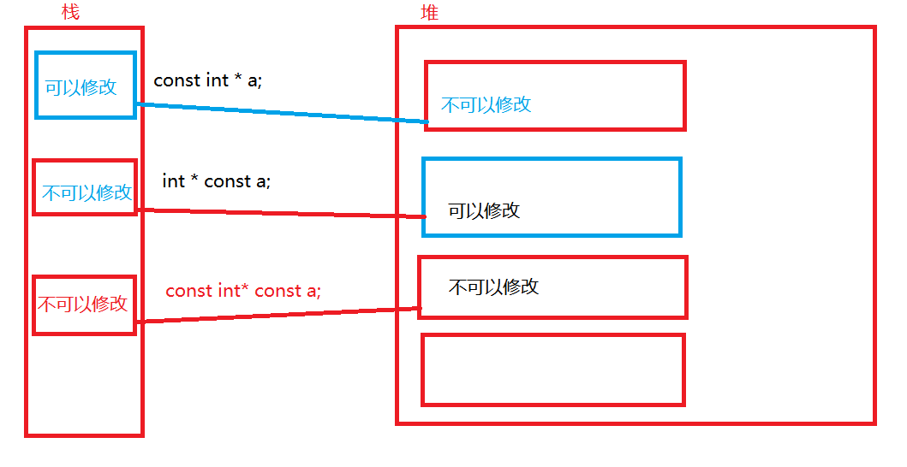
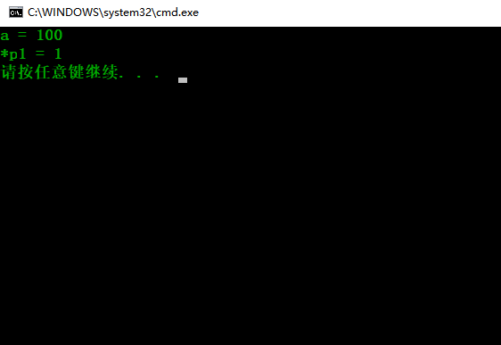

# const的增强

`const int * a`表示指针指向的内存空间不可以修改

`int * const a`表示不能修改a的指向

`const int * const a` 表示a的内存和a所指向的内存都不可以修改





```c++
#include<iostream>

using namespace std;

int main(int argc, char* argv[])
{
	//在c语言中a是一个假常量,c++中a是一个真的常量,只不过在编译阶段完成,而不是预处理阶段
	const int a = 100;

	//创建一个临时变量的地址赋值给p1,所以修改*p1时,a不会改变
	int * p1 = (int *)&a;

	//c++中const修饰过的整型变量可以声明数组,c语言不可以
	int array[a] = { 0 };

	*p1 = 1;
	
	cout << "a = " << a << endl;
	cout << "*p1 = " << *p1 << endl;


	return 0;
}


```

