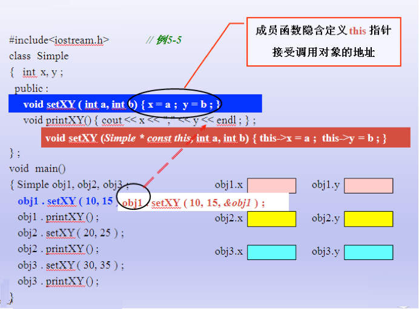

```cpp
#define _CRT_SECURE_NO_WARNINGS
#include<iostream>
#include<cstring>

using namespace std;

class Student
{
public:
	Student();
	~Student();
	Student(const char * name,int score);
	//在成员函数后面加上const代表不能修改成员变量
	const char * getName()const;
	void print()const;
private:
	char * name;
	int score;
	int xueHao;
	static int jXueHao;
};
int Student::jXueHao = 10000;


//打印类成员
void Student::print() const
{
	cout << name << endl;
	cout << score << endl;
	cout << xueHao << endl;
}


//返回name
const char * Student::getName()const
{
	return this->name;
}

Student::Student(const char * name, int score)
{
	int len = strlen(name) + 1;

	this->name = new char[len];

	strcpy(this->name, name);

	this -> score = score;

	xueHao = jXueHao + 1;
	jXueHao++;

}

Student::Student()
{
	name = NULL;
	xueHao = jXueHao + 1;
	jXueHao++;
}

Student::~Student()
{
	if (name != NULL)
	{
		delete[] name;
		name = NULL;
	}
}

void test() {
	Student s1("XiaoMing", 100);

	s1.print();
	cout << s1.getName() << endl;
}

int main(char *argv[], int argc)
{
	test();

	return 0;
}

```


