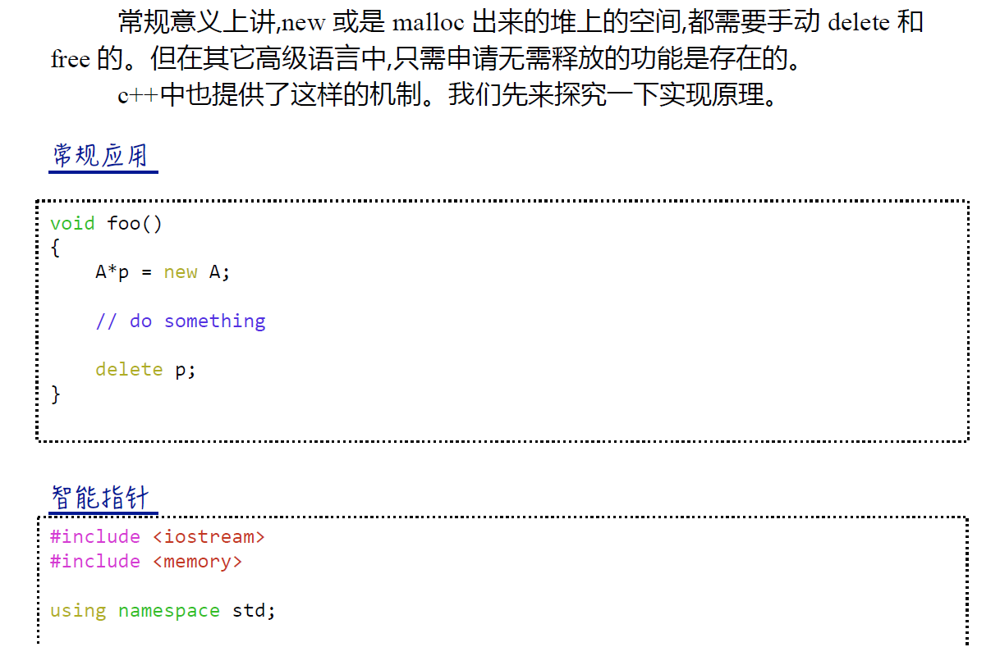

# 自定义智能指针和重载相关操作符


## 智能指针




```cpp
#define _CRT_SECURE_NO_WARNINGS
#include<iostream>
#include<memory>

using namespace std;

class A
{
public:
	A();
	~A();
	A(int x) { a = x; }
	void printf() {
		cout << a << endl;
	}
private:
	int a;
};

A::A()
{
	cout << "A()..." << endl;
}

A::~A()
{
	cout << "~A()..." << endl;
}

void test() {
	//智能指针,不需要手动delete
	auto_ptr<A> a(new A(10));

	a->printf();
}

int main(char *argv[], int argc)
{
	test();

	return 0;
}

```


## 自定义智能指针和重载->  *操作符

```cpp
#define _CRT_SECURE_NO_WARNINGS
#include<iostream>


using namespace std;

class A
{
public:
	A();
	A(int x) { a = x; cout << "A(int x).." << endl; }
	~A();
	int getA() { return a; }
private:
	int a;
};
//自定义智能指针类
class MyPtr
{
public:
	MyPtr();
	MyPtr(A * tPtr) { ptr = tPtr; }

	//重载->操作符
	A * operator->() {
		return ptr;
	}
	//重载*操作符
	A & operator*() {
		return *ptr;
	}
	~MyPtr();

private:
	A * ptr;
};


MyPtr::MyPtr()
{
	ptr = NULL;
}

MyPtr::~MyPtr()
{
	if (ptr != NULL)
	{

		delete ptr;
		ptr = NULL;
	}
}


A::A()
{
	cout << "A()..." << endl;
}

A::~A()
{
	cout << "~A()..." << endl;
}

void test1() {
	MyPtr mP(new A(20));
	cout << mP->getA() << endl;
	cout << (*mP).getA() << endl;

}

int main(char *argv[], int argc)
{
	test1();

	return 0;
}

```

