### C语言的汇编表示方式

在C语言里插入汇编

```C
__asm{
	mov eax,1
	mov ecx,eax
}
```


```c
#include<stdio.h>
int add(int a, int b)
{
	
	
	return a + b;;
}

int main()
{
	__asm mov eax, 1;
	add(1, 2);

	return 0;
}
```


```
int main()
{
00D71D90  push        ebp  
00D71D91  mov         ebp,esp  
00D71D93  sub         esp,0C0h  
00D71D99  push        ebx  
00D71D9A  push        esi  
00D71D9B  push        edi  
00D71D9C  lea         edi,[ebp+FFFFFF40h]  
00D71DA2  mov         ecx,30h  
00D71DA7  mov         eax,0CCCCCCCCh  
00D71DAC  rep stos    dword ptr es:[edi]  
	__asm mov eax, 1;
00D71DAE  mov         eax,1  
00D71DB3  push        2  
00D71DB5  push        1  
00D71DB7  call        00D71370  
00D71DBC  add         esp,8  
	add(1, 2);

	return 0;
00D71DBF  xor         eax,eax  
}
00D71DC1  pop         edi  
}
00D71DC2  pop         esi  
00D71DC3  pop         ebx  
00D71DC4  add         esp,0C0h  
00D71DCA  cmp         ebp,esp  
00D71DCC  call        00D7120D  
00D71DD1  mov         esp,ebp  
00D71DD3  pop         ebp  
00D71DD4  ret  


int add(int a, int b)
{
00D724B0  push        ebp  
00D724B1  mov         ebp,esp  
00D724B3  sub         esp,0C0h  
00D724B9  push        ebx  
00D724BA  push        esi  
00D724BB  push        edi  
00D724BC  lea         edi,[ebp+FFFFFF40h]  
00D724C2  mov         ecx,30h  
00D724C7  mov         eax,0CCCCCCCCh  
00D724CC  rep stos    dword ptr es:[edi]  
00D724CE  mov         ecx,0D7B003h  
00D724D3  call        00D71203  
	
	
	return a + b;;
00D724D8  mov         eax,dword ptr [ebp+8]  
00D724DB  add         eax,dword ptr [ebp+0Ch]  
}
00D724DE  pop         edi  
00D724DF  pop         esi  
00D724E0  pop         ebx  
00D724E1  add         esp,0C0h  
00D724E7  cmp         ebp,esp  
00D724E9  call        00D7120D  
00D724EE  mov         esp,ebp  
00D724F0  pop         ebp  
00D724F1  ret  
```


#### main函数(入/出)栈图

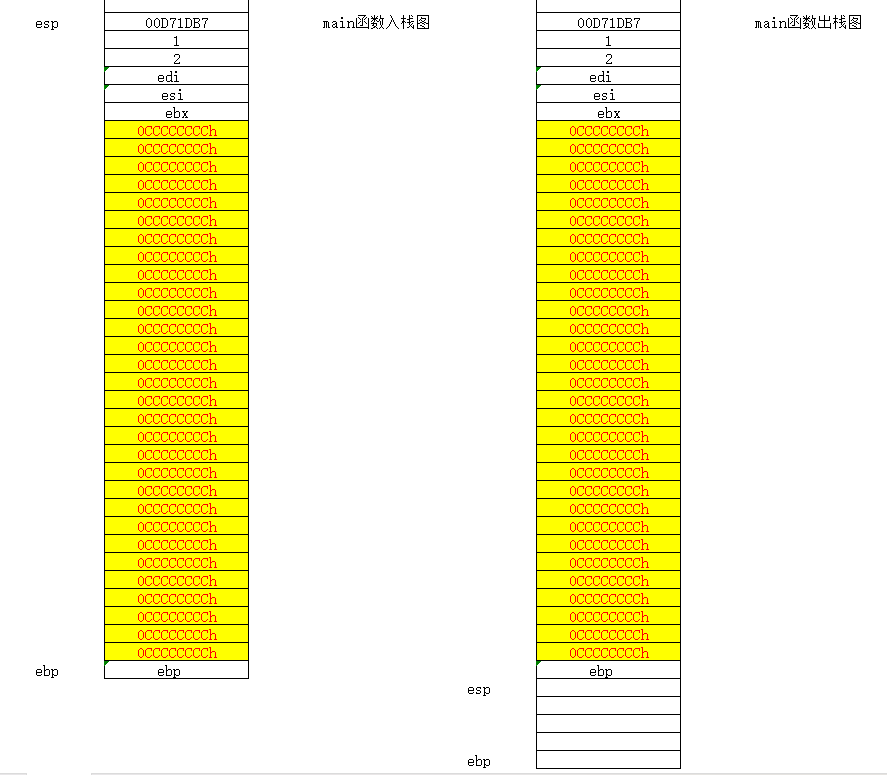


函数返回结果一般存放在eax中

###  参数传递与返回值

```
add(1, 2);
	
int add(int a, int b)
{
	
	
	return a + b;;
}
```


```

//将2,1入栈,调用add函数,最后堆栈平衡
00B21DB3  push        2  
00B21DB5  push        1  
00B21DB7  call        _add (0B21370h)  
00B21DBC  add         esp,8  


//将a的值放入eax中
return a + b;;
00B224D8  mov         eax,dword ptr [a]  
	

将a的值和b 的值相加,并且存入eax中
return a + b;;
00B224DB  add         eax,dword ptr [b]  
```


### 变量

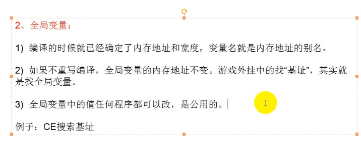

全局变量在CE中显示绿色


### 变量与参数的内存布局

函数参数存放在堆栈中,一般是以ebp-8开始

局部变量存放在堆栈红,一般是以ebp+8开始

返回值一般存放在eax中


### 整数类型

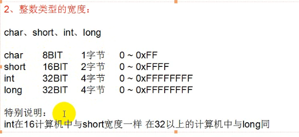

数据溢出是把高位舍弃掉


有符号和无符号的区别:

拓展时与比较时才有区别


```
拓展:
有符号拓展
char c = 1;	//c=00000001
int b = c; 	//b = 00000000 00000000 00000000 00000001

char  c = -1;	//c = 11111111
				b本来是 00000000 00000000 00000000 00000000
				赋值后 00000000 00000000 00000000 11111111
				因为c是有符号类型且最高位是1,所以前面的0都用c的符号位去填充
int b = c;		b = 11111111 11111111 11111111 11111111


无符号拓展

unsigned char c = -1;	//c = 11111111
无符号号数扩展直接填充0,不需要看符号位填充
int b = c;		// b = 00000000 00000000 00000000 11111111

```


```
unsigned char i = -1;		
unsigned char j = 1;		
		
if(i>j)		
{		
	printf("i>j");	
}		
else		
{		
	printf("i<j");	
}		

i = -1 = FFFFFFFF

j = 1 = 00000001

因为都是无符号类型,所以i>j
```


### 浮点类型

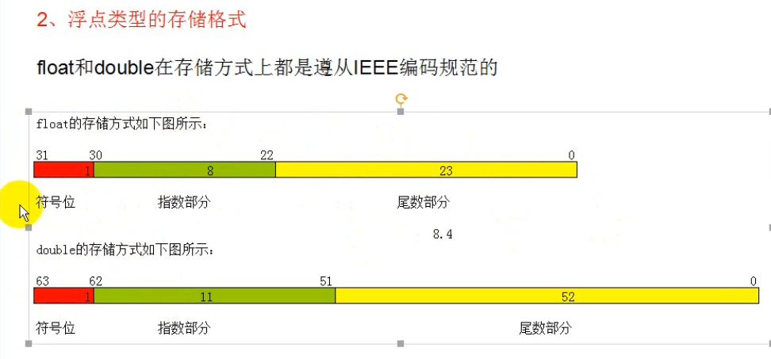

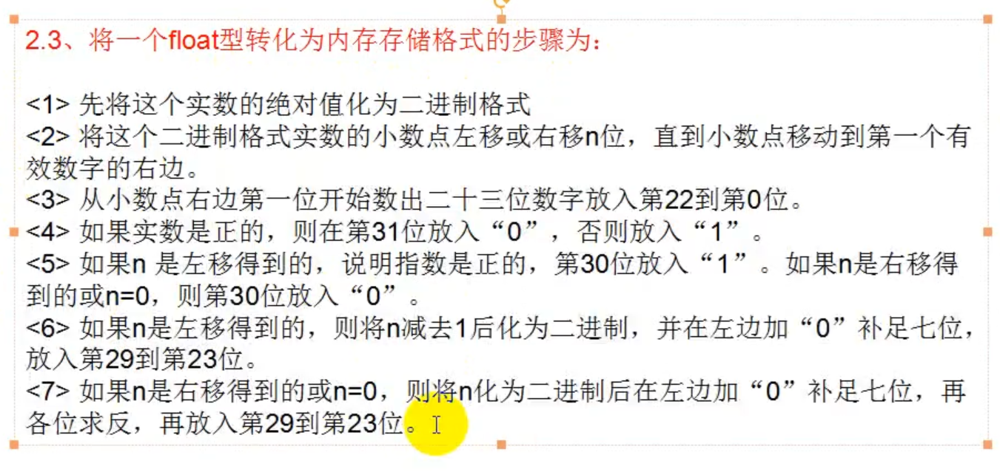


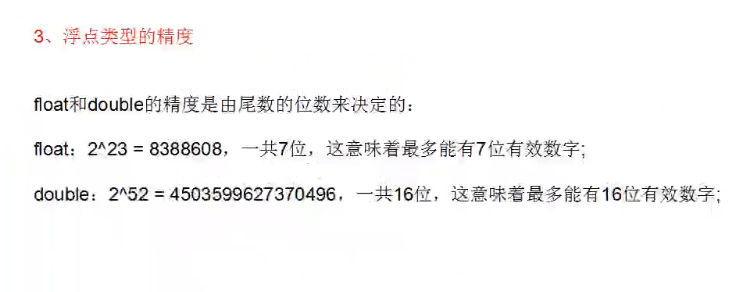

也就是8.25用float或double类型,有效数字是包含整数部分的

```
比如 8.25
先将整数部分转换为二进制
8 == 1000

0.25转换小数部分
0.25 == 0.01(二进制)
0  1
0.25*2 = 0.5
0.5 * 2 = 1

小数部分0.4 == 0.1100转成二进制：
0.4 == 0.1100(二进制)
0.4*2 = 0.8
0.8*2 = 1.6
0.6*2 = 1.2
0.2*2 = 0.4
0.4*2 = 0.8
...

8.25 == 1000.01(二进制)
转换为科学计数法 1000.01 == 1.00001 * 2^3

符号位是0 (正数是0,负数是1)
指数符号位是1 (小数点向左移就填1,向右移就填0)
指数位是 3 所以3-1 = 2 == 10 ==0000010(10二进制写后面,前面部分用0 补)
尾数部分是 1 从左往右写入内存不够用0补(10000000000000000000000)

8.25的内存存储形式:
符号位	  指数符号位		指数移动数		二进制小数部分
0 		1	      	000010			10000000000000000000000
0100 0001 0000 0100 0000 0000 0000
转换为16进制
4     1    0    4   0     0    0
小数转换到二进制是不完全精确的


0.25转换为二进制小数
整数部分 0
小数部分 01
0.25 == 0.01
0.01转换为科学计数法 == 1 * 2^-2

实数是正数所以是0
指数符号 0(因为是向右移动得到的)
指数位 1111101
	步骤:
	2 == 0000010
	按位取反==1111101
尾数部分是0(因为1 *2%-2,1后面没有小数)

0.25的内存存储形式:
符号位		指数符号位	指数移动数		二进制小数部分
0 			0  			1111101 	 00000000000000000000000
0011 1110 1000 0000 0000 0000 0000 0000
3	  E    8    0    0    0    0    0
```

### movss指令

移动一个标量的单精度浮点数（float）值。

```
movss xmm1, xmm2/m32  ; 从另一个 XMM 寄存器或内存中复制一个 float 到 xmm1
movss xmm2/m32, xmm1  ; 把 xmm1 中的 float 值写到另一个 xmm 或内存中
```


###  字符与字符串

```
//编译器会将'a'拿去ASCII表中查找对应'a'的数值
char c = 'a';
//因为c存放的是'a'的数值所以putchar会用c的数值去ASCII表中查找,最后输'a'
putchar(c);

//str存放的是"abcd"中的第一个字符的地址(指针)

char str[] = "abcd"
```


### 中文字符

一个中文字符用两个127以上的数值表示

一个字节是一个中文字体的一半,所以要两个字节存放一个汉字

中文字符编码GB2312或GB2312-80

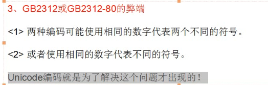

比如D0D6在中国代表中字,在韩国可能就是另外一种字体.这样的软件是不通用的


```
int main()
{
	char str[] = "我";

	return 0;
}
```

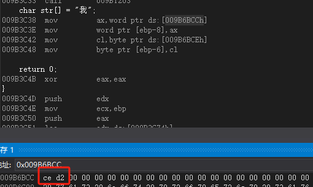


### 运算符与表达式

不同数据类型运算时会进行扩展

比如一个int类型，一个float类型做运算时，会提升为float类型或double类型

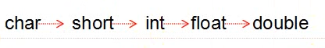


#### setg和setl

它们用于将 **标志寄存器的结果（ZF、SF、OF 等）转换为布尔值（0 或 1）** 存入目标寄存器或内存中。

```
指令		含义				条件				通常用于比较（cmp）后
setg	Set if Greater	ZF=0 且 SF=OF	有符号大于（>）

setl	Set if Less	SF≠OF	有符号小于（<）
```


用法

```
setg  reg/mem8   ; 如果比较结果为 "greater"，则设置为 1，否则为 0

setl  reg/mem8   ; 如果比较结果为 "less"，则设置为 1，否则为 0


mov eax, 10
mov ebx, 5
cmp eax, ebx    ; 相当于 10 - 5
setg al         ; 因为 10 > 5，al = 1
setl bl         ; 因为 10 < 5 不成立，bl = 0
```

```
setg / setl 是 有符号数比较
```


```
指令	有符号/无符号	等价条件	说明
seta	无符号	(CF = 0) && (ZF = 0)	无符号 a > b
setb	无符号	CF = 1	无符号 a < b
```


```
指令		条件						有符号							含义
sete	ZF == 1						无关							相等（==）
setne	ZF == 0						无关							不等（!=）
setg	ZF == 0 && SF == OF			✅							大于（>）
setge	SF == OF					✅							大于等于（>=）
setl	SF != OF					✅							小于（<）
setle		小于或等于	(ZF = 1) or (SF ≠ OF)						a <= b
seta	CF == 0 && ZF == 0			❌							无符号大于
setb	CF == 1						❌							无符号小于
```

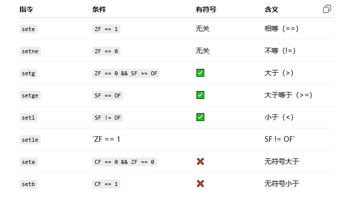


#### shr,sar,shl

`shr`、`sar`、`shl` 是 **x86/x64 汇编指令**中用于**移位操作（bit shift）**的指令，用于对寄存器或内存中的数据执行按位左移或右移。

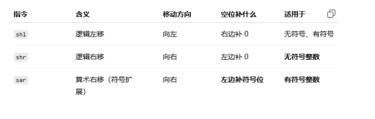

### 分支语句

```
#include<stdio.h>


int add(int a, int b)
{
	
	
	return a + b;;
}

int main()
{
	int x, y;
	x = 10;
	y = 20;

	if (x > y)
	{
		printf("x > y");
	}
	else
	{
		printf("x < y");
	}

	return 0;
}
```


```
int x, y;
	x = 10;
00194F18  mov         dword ptr [ebp-8],0Ah  
	y = 20;
00194F1F  mov         dword ptr [ebp-14h],14h  

	if (x > y)
00194F26  mov         eax,dword ptr [ebp-8]  
00194F29  cmp         eax,dword ptr [ebp-14h]  
00194F2C  jle         00194F3D  //如果x<=y就会跳转
	{
		printf("x > y");
00194F2E  push        197B30h  
00194F33  call        0019104B  
00194F38  add         esp,4  
	}
00194F3B  jmp         00194F4A  
	else
	{
		printf("x < y");
00194F3D  push        197BD4h  
00194F42  call        0019104B  
00194F47  add         esp,4  
	}

	return 0;
00194F4A  xor         eax,eax  
}
```

### movzx/movsx指令

| 指令    | 含义                   | 高位如何填充       | 用于哪种数？ |
| ------- | ---------------------- | ------------------ | ------------ |
| `movsx` | 带符号扩展的移动       | 补符号位（最高位） | ✅ 有符号数   |
| `movzx` | 带**零扩展**的移动指令 | 全部补 0           | ✅ 无符号数   |

```
movzx destination_reg, source_reg/mem
movsx destination_reg, source_reg/mem
```

**destination_reg**：目标寄存器，必须是 16 位或 32 位或 64 位

**source_reg/mem**：源寄存器或内存，必须是 8 位或 16 位

会把低位的值复制过来，并将高位 **补 0**或**补符号位**

```
mov al, 0xFF        ; al = 11111111b = 255
movzx eax, al       ; eax = 000000FFh = 255（32位）
```


### SWITCH

```
#include<stdio.h>


int add(int a, int b)
{
	
	
	return a + b;;
}

int main()
{
	int x = 5;

	switch (2)
	{

	case 3:

		printf("1111");
		break;
	case 1:
	
		printf("1111");
		break;
	case 2:
	
		printf("1111");
		break;
	
	case 4:
	
		printf("1111");
		break;
	case 100:
		printf("1111");
		break;
	default:
		printf("1111");		
		break;
	}

	return 0;
}
```


#### case 数量小于4的时候没有索引表

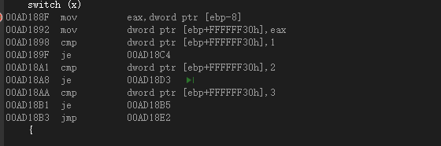


#### case数量大于3就会用索引表

这里减1是因为case数值最小的就是1，如果case最小是100，那么减的就是一百

```
006A189E  sub         ecx,1  
```

##### 索引表的顺序与case存放的顺序无关，索引表的顺序取决于case数值的大小，一般数值最小的放在最前面，从小到大写入

索引值从0开始

这个程序的索引表是006A192Ch

```
006A18B6  jmp         dword ptr [edx*4+006A192Ch]  
```

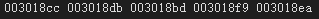


case断层也会从最小数值到最大数值按顺序填充索引表

比如case最小是1,最大是5,中间有2,3,没有4,也会写将4写入索引表中,4的索引表内容是default的地址

#### 记录索引的索引表

如果case断层距离相差很大,比如有case1,2,3,4,100；5-99都是不存在的，那么会建立一个记录索引的索引表，通过这个记录索引的索引表来查询对应的索引的值，5-99的记录索引的索引表内容就会用default的索引值填充。

这里的05就是default的索引值。

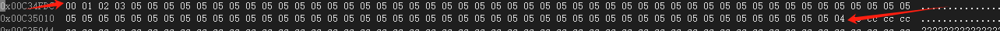

这个就是索引值表，然后通过索引值去访问跳转索引表


这个程序一共有两个表，一个是记录索引值的表，一个是索引表

```
movzx       edx,byte ptr [ecx+00C34FDCh]	//查找对应的索引值
jmp         dword ptr [edx*4+00C34FC4h]  	//通过索引值*4+00C34FC4h找到具体跳转的位置
```

这是跳转索引表

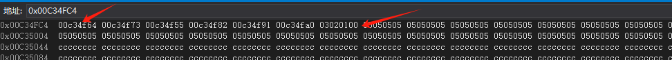

```
	int x = 5;
00C34F18  mov         dword ptr [ebp-8],5  

	switch (2)
00C34F1F  mov         dword ptr [ebp+FFFFFF30h],2  
00C34F29  mov         eax,dword ptr [ebp+FFFFFF30h]  
00C34F2F  sub         eax,1  
00C34F32  mov         dword ptr [ebp+FFFFFF30h],eax  
00C34F38  cmp         dword ptr [ebp+FFFFFF30h],63h  
00C34F3F  ja          00C34FA0  
00C34F41  mov         ecx,dword ptr [ebp+FFFFFF30h]  
00C34F47  movzx       edx,byte ptr [ecx+00C34FDCh]  
00C34F4E  jmp         dword ptr [edx*4+00C34FC4h]  
	{

	case 3:

		printf("1111");
00C34F55  push        0C37B30h  
00C34F5A  call        00C3104B  
00C34F5F  add         esp,4  
		break;
00C34F62  jmp         00C34FAD  
	case 1:
	
		printf("1111");
00C34F64  push        0C37B30h  
00C34F69  call        00C3104B  
00C34F6E  add         esp,4  
		break;
00C34F71  jmp         00C34FAD  
	case 2:
	
		printf("1111");
00C34F73  push        0C37B30h  
	case 2:
	
		printf("1111");
00C34F78  call        00C3104B  
00C34F7D  add         esp,4  
		break;
00C34F80  jmp         00C34FAD  
	
	case 4:
	
		printf("1111");
00C34F82  push        0C37B30h  
00C34F87  call        00C3104B  
00C34F8C  add         esp,4  
		break;
00C34F8F  jmp         00C34FAD  
	case 100:
		printf("1111");
00C34F91  push        0C37B30h  
00C34F96  call        00C3104B  
00C34F9B  add         esp,4  
		break;
00C34F9E  jmp         00C34FAD  
	default:
		printf("1111");		
00C34FA0  push        0C37B30h  
00C34FA5  call        00C3104B  
00C34FAA  add         esp,4  
		break;
	}

```


### 循环语句

在汇编中只要往回跳的大部分都是循环。

#### while循环

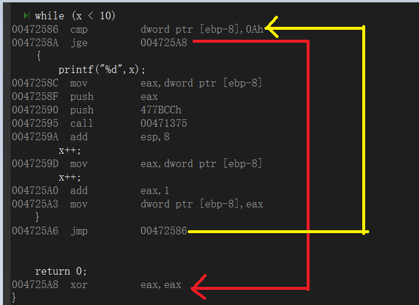


#### do while循环

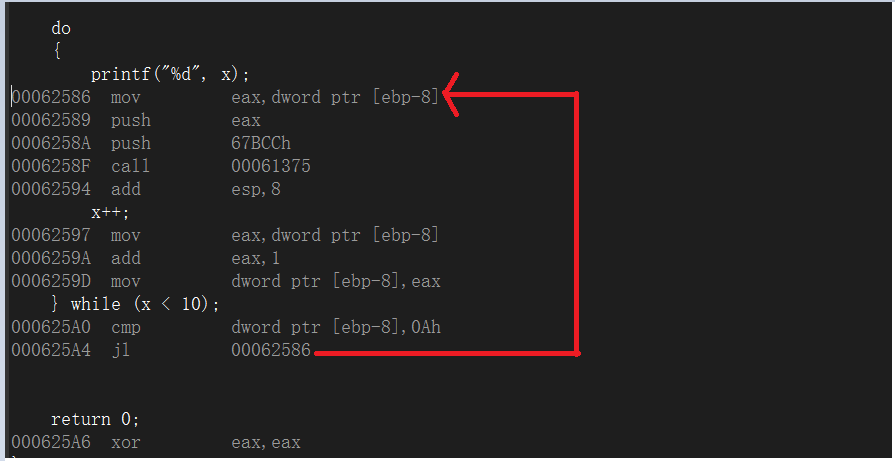

.


#### for循环

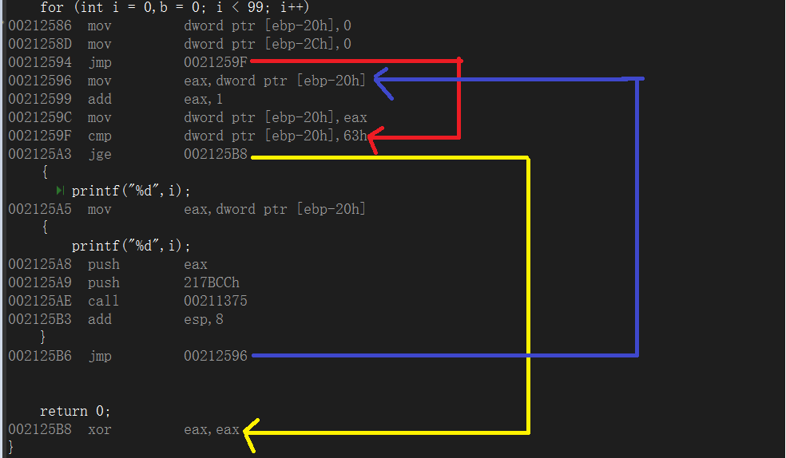


### windows自动启动注册表

| 路径                                                         | 说明                                 | 适用范围       |
| ------------------------------------------------------------ | ------------------------------------ | -------------- |
| `HKEY_LOCAL_MACHINE\SOFTWARE\Microsoft\Windows\CurrentVersion\Run` | **系统级（所有用户）** 开机启动      | 对所有用户生效 |
| `HKEY_CURRENT_USER\Software\Microsoft\Windows\CurrentVersion\Run` | **当前用户** 开机启动                | 仅当前登录用户 |
| `HKEY_LOCAL_MACHINE\SOFTWARE\Wow6432Node\Microsoft\Windows\CurrentVersion\Run` | **32 位程序的启动项（64 位系统上）** | 针对 32 位程序 |

| 路径                                                         | 用途说明                                   |
| ------------------------------------------------------------ | ------------------------------------------ |
| `HKEY_LOCAL_MACHINE\SOFTWARE\Microsoft\Windows\CurrentVersion\RunOnce` | 仅在下一次开机时启动一次（常用于安装器）   |
| `HKEY_CURRENT_USER\Software\Microsoft\Windows\CurrentVersion\RunOnce` | 同上，作用于当前用户                       |
| `HKEY_LOCAL_MACHINE\SOFTWARE\Microsoft\Windows\CurrentVersion\Policies\Explorer\Run` | 管理策略强制启动，较少见                   |
| `HKEY_LOCAL_MACHINE\SYSTEM\CurrentControlSet\Services`       | 注册服务（比启动项更早启动）               |
| `HKEY_LOCAL_MACHINE\SOFTWARE\Microsoft\Active Setup\Installed Components` | 某些程序开机初始化使用                     |
| `HKEY_LOCAL_MACHINE\Software\Microsoft\Windows NT\CurrentVersion\Winlogon\Userinit` | 控制用户登录后启动的程序，常用于系统级后门 |


## 数组


```
#include<stdio.h>
#include<windows.h>


int main()
{
	char c[10] = { '1' };

	printf("%d",sizeof c);


	return 0;
}


```

申请10个字节的数组分配了12个字节,是因为内存默认是以4字节对齐的12是4的倍数。

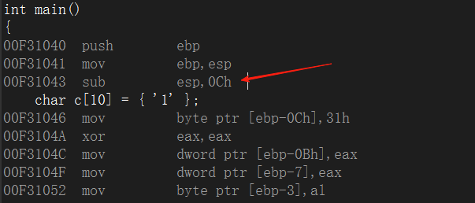

局部变量数组是从右到左入栈的，数值10放在栈底，数值1放在栈顶。

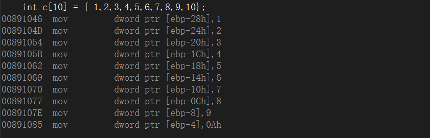

#### 缓冲区溢出

```
#include<stdio.h>
#include<windows.h>

void Fun()
{
	while (1) {
		printf("111\n");
	}
}

int yichu() {

	int a[8] = { 1,2 };

	a[9] = (int)Fun;

	return 0;

}

int main()
{
	yichu();

	return 0;
}

```

因为a[7]==ebp-4,a[8] ==ebp,a[9] == ebp+4。刚刚好ebp+4等于返回地址，所以	a[9] = (int)Fun覆盖原来的返回地址

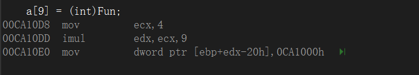

```
	a[9] = (int)Fun;
```


#### imul

| 用法形式                 | 示例                | 说明                                           |
| ------------------------ | ------------------- | ---------------------------------------------- |
| `imul r/m32`             | `imul eax`          | 隐式用 `eax` 和 `r/m32` 相乘，结果在 `edx:eax` |
| `imul reg32, r/m32`      | `imul eax, ebx`     | `eax = eax * ebx`                              |
| `imul reg32, r/m32, imm` | `imul eax, ebx, 10` | `eax = ebx * 10`                               |

##### 单操作数形式

```
mov eax, 3
imul dword ptr [ebx] ; eax * [ebx]，结果在 edx:eax
```

`imul` 自动使用 `eax` 和操作数相乘，结果 64 位存在 `edx:eax`。

##### 双操作数形式

```
imul eax, ebx ; eax = eax * ebx
```

只保留 32 位结果，溢出会导致结果错误，但不会引发异常。

##### 三操作数形式

```
imul eax, ebx, 100 ; eax = ebx * 100
```

常用于计算偏移量，例如数组索引乘元素大小。

##### 标志位影响

- **OF（溢出标志）** 和 **CF（进位标志）**：
  - 如果结果超出目标寄存器大小，这两个标志会被置位。
- **ZF/SF/PF**：不受影响。


## 结构体

```
#include<stdio.h>
#include<windows.h>

struct MY {
	char a;
	char b;
	int c;
};

int main()
{
	struct MY m = { 'a','b',123 };

	return 0;
}


```

结构体的局部变量也是从右到左入栈的

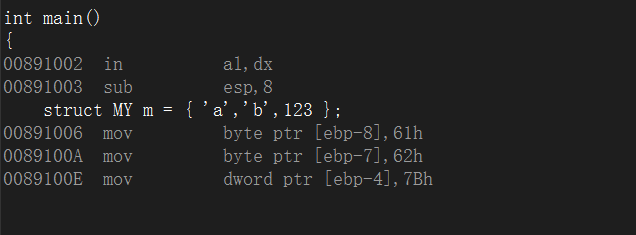


## 字节对齐

什么是字节对齐?

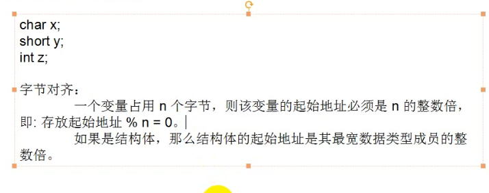

#### #pragma pack(字节对齐数)

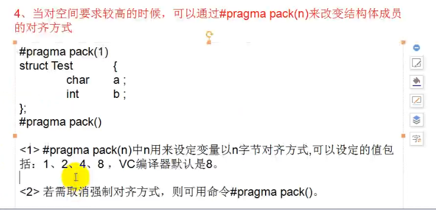


结构体的总大小: Min(某个成员的最大字节数,对齐参数)的倍数

例如

MY结构体的总大小是Min(4,1)的倍数,也就是1的倍数,因为最大是int 4个字节,对齐参数是1

```
#pragma pack(1)
struct MY {
	char a;
	char b;
	int c;
};
#pragma pack()
```

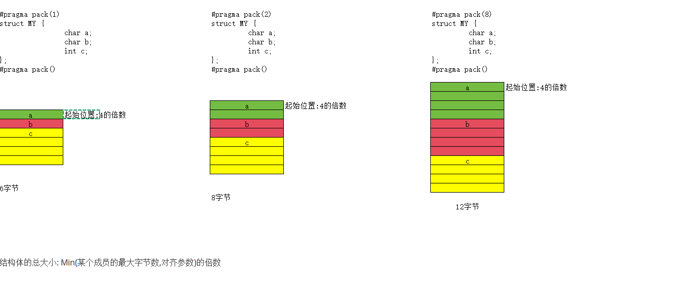

## 结构体数组

```
#include<stdio.h>
#include<windows.h>
#pragma pack(1)
struct MY {
	char a;
	char b;
	int c;
};
#pragma pack()

int main()
{
	struct MY m[3] = {
		{'a','b',123},
		{'a','b',123},
		{'a','b',123}
	};

	return 0;
}
```

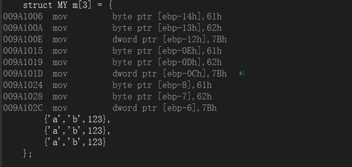


## 指针类型

#### 指针宽度

如果是64位程序,指针类型的宽度是8字节,如果是32位程序,指针类型的宽度是4字节


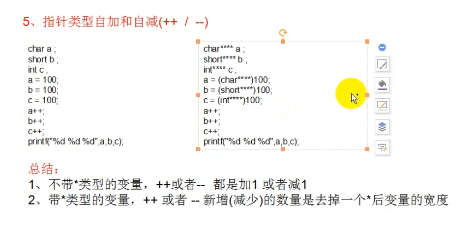


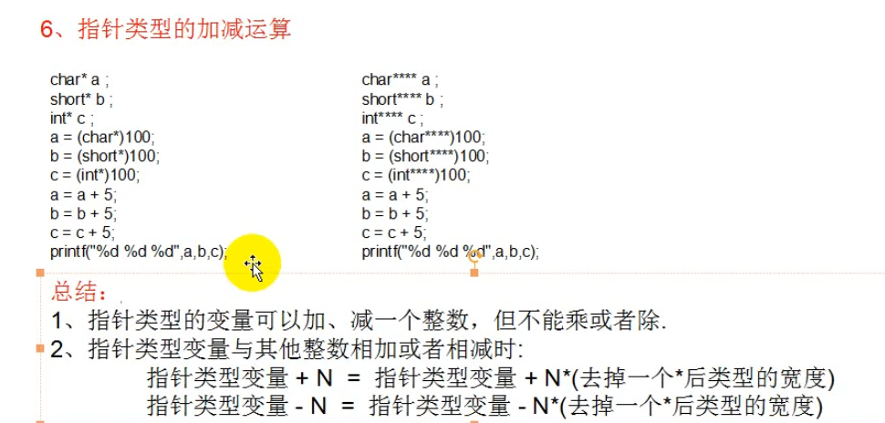


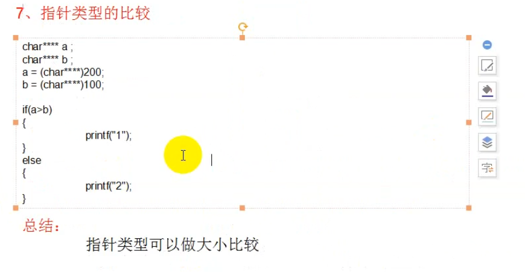

## 取地址符

1、&是取地址符，任何变量都可以使用&来获取地址，但不能用在常量上。

2、探测&变量 的类型

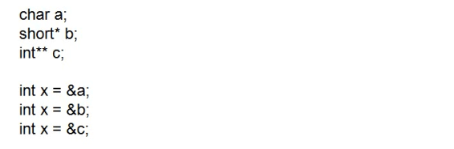


## 取值运算符


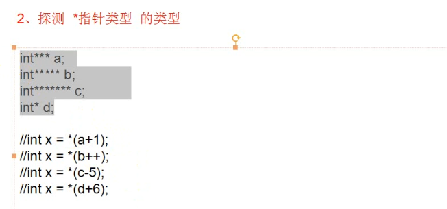

```
*加指针类型的类型是指针类型减去一个*
```

