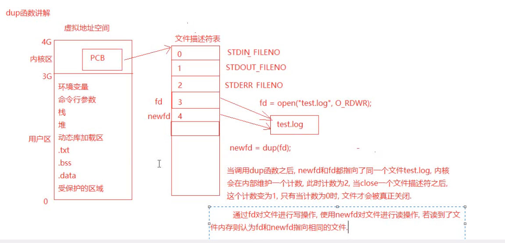

### dup函数

#### 头文件

```
#include <unistd.h>
```

函数描述: 复制文件描述符

#### 函数原型:

```
int dup(int oldfd);
```

#### 函数参数: 

`oldfd -`要复制的文件描述符

#### 函数返回值:

 成功: 返回最小且没被占用的文件描述符

失败: 返回-1, 设置errno值

```
//测试dup函数复制文件描述符
#include <stdio.h>
#include <stdlib.h>
#include <string.h>
#include <sys/types.h>
#include <unistd.h>
#include <sys/types.h>
#include <sys/stat.h>
#include <fcntl.h>

int main(int argc, char *argv[])
{
	//打开文件
	int fd = open(argv[1], O_RDWR);
	if(fd<0)
	{
		perror("open error");
		return -1;
	}

	//调用dup函数复制fd
	int newfd = dup(fd);
	printf("newfd:[%d], fd:[%d]\n", newfd, fd);

	//使用fd对文件进行写操作
	write(fd, "hello world", strlen("hello world"));

	//调用lseek函数移动文件指针到开始处
	lseek(fd, 0, SEEK_SET);

	//使用newfd读文件
	char buf[64];
	memset(buf, 0x00, sizeof(buf));
	int n = read(newfd, buf, sizeof(buf));
	printf("read over: n==[%d], buf==[%s]\n", n, buf);

	//关闭文件
	close(fd);
	close(newfd);

	return 0;
}

```

