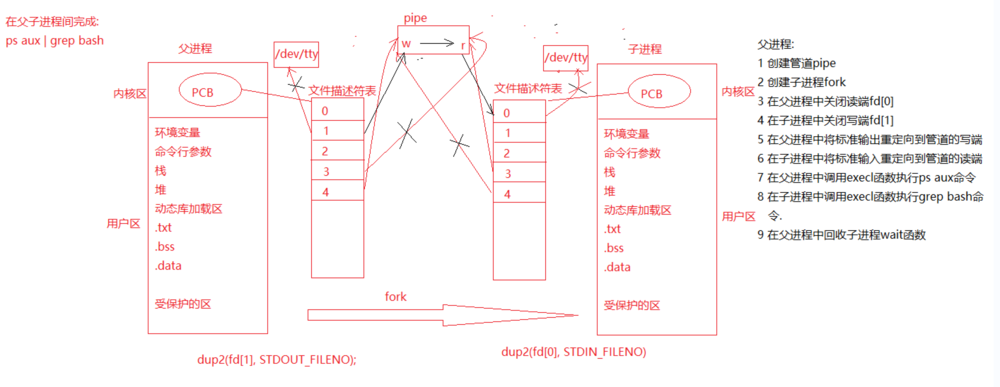

输入`grep bash` 回车之后默认情况下是等待终端输入数据

```c
//使用pipe完成ps aux | grep bash操作
#include <stdio.h>
#include <stdlib.h>
#include <string.h>
#include <sys/types.h>
#include <unistd.h>
#include <sys/wait.h>

int main()
{
	//创建管道
	//int pipe(int pipefd[2]);
	int fd[2];
	int ret = pipe(fd);
	if(ret<0)
	{
		perror("pipe error");
		return -1;
	}

	//创建子进程
	pid_t pid = fork();
	if(pid<0) 
	{
		perror("fork error");
		return -1;
	}
	else if(pid>0)
	{
		//关闭读端
		close(fd[0]);

		//将标准输出重定向到管道的写端
		dup2(fd[1], STDOUT_FILENO);
		
		execlp("ps", "ps", "aux", NULL);

		perror("execlp error");
	}
	else 
	{
		//关闭写端
		close(fd[1]);
	
		//将标准输入重定向到管道的读端
		dup2(fd[0], STDIN_FILENO);

		execlp("grep", "grep", "--color=auto", "bash", NULL);

		perror("execlp error");
	}

	return 0;
}

```

