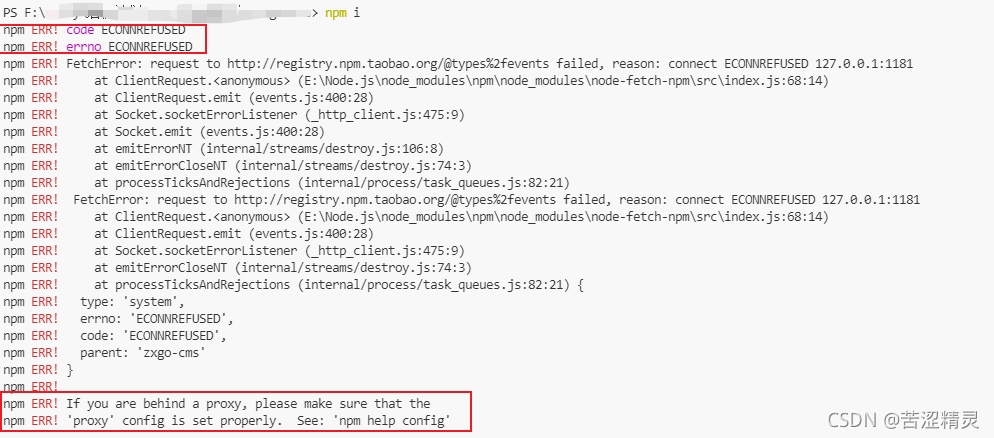

npm报错：npm ERR! code ECONNREFUSED npm ERR! errno ECONNREFUSED，npm ERR! npm ERR! If you are behind a proxy, please make sure that the

在仓库上拉下来项目，安装依赖时报错：




```
问题出现原因：Github相当于程序员的百度，但是速度有时又太慢，就使用了某VPN代理访问。结果，VPN给我开了一个端口，npm的一些依赖包访问速度巨慢，就出现了上图报错
```

### 解决方法

#### 1. 查看代理

```
npm config get proxy
npm config get https-proxy
```

如果发现有代理，就清空它

```
npm config delete proxy
npm config delete https-proxy
```

### 2. 全局配置淘宝镜像

```
npm install -g cnpm --registry=https://registry.npm.taobao.org 
```

这里再安装依赖就OK了