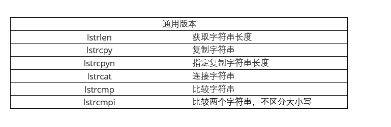

# Unicode简介


|   两种字符集   |    ASCII    | Unicode(宽字符) |
| :------------: | :---------: | :-------------: |
|  两种字符类型  |    char     |     wchar_t     |
|                |    CHAR     |      WCHAR      |
| 函数的两种版本 |   printf    |     wprintf     |
|                |   strlen    |     wcslen      |
|                | MessageBoxA |   MessageBoxW   |
|                |    PCHAR    |     PWCHAR      |
|                |             |                 |
|                |  通用版本   |                 |
|    _tcslen     | MessageBox  |      TCHAR      |
|     PTCHAR     |             |                 |
|                |             |                 |
|                |   通用宏    |                 |
|      TEXT      |   __TEXT_   |       __T       |
|       _T       |             |                 |


```c
#include<stdio.h>
#include<wchar.h>
#include<windows.h>
#include<locale.h>

//ASCII 版本  多字节字符集   双字节字符集
void test1() {

	char a = 'A';
	char str[] = "我爱你";
	CHAR a2 = 'A';

	printf("%c\n", a);
	printf("%s\n", str);
	printf("%d\n", strlen(str));
	MessageBoxA(NULL, str, NULL, MB_OK);

}
//Unicode 版本
void test2() {

	setlocale(LC_ALL, "chs");
	wchar_t a = L'A';
	wchar_t str[] = L"我爱你";
	WCHAR a2 = L'A';

	wprintf(L"%lc\n", a);
	wprintf(L"%ls\n", str);
	wprintf(L"%d\n", wcslen(str));  //这里显示3个字符,是因为把两个字节当一个字符处理
	MessageBoxW(NULL, str, NULL, MB_OK);
}
//通用版本,一般使用这个
void test3()
{
	setlocale(LC_ALL, "chs");
	TCHAR a = TEXT('A');
	TCHAR str[] = TEXT("我爱你");
	TCHAR a2 = TEXT('A');

	MessageBox(NULL, str, NULL, MB_OK);
}
int main(int argc,char * argv[]) 
{
	test1();
	test2();
	test3();
	return 0;
}


```


| Windows中使用sprintf    |            |             |               |
| ----------------------- | ---------- | ----------- | ------------- |
|                         | ASCII版本  | 宽字符版本  | 通用版本      |
| 可变数目的参数          |            |             |               |
| 标准版                  | sprintf    | swprintf    | `_stprintf`   |
| 最大长度版              | _snprintf  | _snwprintf  | `_sntprintf`  |
| windows版               | wsprintfA  | wsprintfW   | wsprintf      |
| ----------------------- | ---------  | ---------   | ---------     |
| 参数数组的指针          |            |             |               |
| 标准版                  | vsprintf   | vswprintf   | vstprintf     |
| 最大长度版              | _vsnprintf | _vsnwprintf | `_vsntprintf` |
| windows版               | wvsprintfA | wvsprintfW  | wvsprintf     |


```c
#define	_CRT_SECURE_NO_WARNINGS
#include<stdio.h>
#include<windows.h>
#include<tchar.h>
#include<stdarg.h>

//自定义ASCII格式化MessageBox函数
int CDECL MessageBoxPrintfA(char *szCaption, char *szFormat, ...);
//自定义Unicode格式化MessageBox函数
int CDECL MessageBoxPrintfW(wchar_t *szCaption, wchar_t *szFormat, ...);

//自定义通用格式化MessageBox函数
int CDECL MessageBoxPrintf(TCHAR *szCaption, TCHAR *szFormat, ...);


//ASCII 版本
void test1() {
	int a = 12;
	char szBuffer[100] = { 0 };

	//不安全版本
	sprintf(szBuffer, "我爱你%d", a);
	MessageBoxA(NULL,szBuffer,"ASCII 不安全版本",MB_OK);

	//安全版本
	_snprintf(szBuffer, 100,"我爱你%d", a);
	MessageBoxA(NULL, szBuffer, "ASCII 安全版本", MB_OK);


}
//Unicode 版本
void test2() {
	int a = 12;
	wchar_t szBuffer[100] = { 0 };

	swprintf(szBuffer,100, L"我爱你%d", a);

	MessageBoxW(NULL, szBuffer, L"Unicode 版本", MB_OK);

	//安全版本
	_snwprintf(szBuffer,100,L"我爱你%d", a);

	MessageBoxW(NULL, szBuffer, L"Unicode 版本", MB_OK);

}
//通用版本
void test3() {
	int a = 12;
	TCHAR szBuffer[100] = { 0 };
	//通用不安全版本
	_stprintf(szBuffer, TEXT("我爱你%d"), a);
	MessageBox(NULL, szBuffer, TEXT("通用不安全版本"), MB_OK);

	//通用安全版本
	_sntprintf(szBuffer, 100, TEXT("我爱你%d"), a);
	
	return MessageBox(NULL, szBuffer, TEXT("通用安全版本"), MB_OK);


}
void test4() {

	MessageBoxPrintf(TEXT("MessageBoxPrintf 标题"), TEXT("我爱你%d%d"), 13, 14);
}
void test5() {
	MessageBoxPrintfA("MessageBoxPrintf 标题", "我爱你%d%d", 13, 14);
}

void test6() {
	MessageBoxPrintfW(L"MessageBoxPrintf 标题", L"我爱你%d%d", 13, 14);
}


int WINAPI WinMain(
	HINSTANCE hInstance,
	HINSTANCE hPrevInstance,
	PSTR szCmdLine,
	int iCmdShow)
{

	//test1();		//ASCII
	//test2();		//Unicode
	//test3();		//通用版本
	//test4();		//通用版本格式化MessageBox
	test5();		//ASCII本格式化MessageBox
	test6();		//Unicode本格式化MessageBox
}


//自定义通用格式化MessageBox函数
int CDECL MessageBoxPrintf(TCHAR *szCaption, TCHAR *szFormat, ...) {

	va_list pArgs;		//用来接收...参数
	TCHAR szBuffer[1024];
	//获取...第一个参数的地址
	va_start(pArgs, szFormat);

	//通用版本_vsntprintf根据平台来决定是ASCII还是Unicode
	//_vsntprintf(通用缓冲区,缓冲区大小,格式字符串,可变参数变量)
	//将szFormat,pArgs的内容放到szBuffer中,并将szFormat中的%xxx,对应替换成pArgs
	_vsntprintf(szBuffer, sizeof(szBuffer) / sizeof(TCHAR), szFormat, pArgs);

	//结束对pArgs变量的使用
	va_end(pArgs);

	return MessageBox(NULL, szBuffer, szCaption, MB_OK);
}


//自定义ASCII格式化MessageBox函数
int CDECL MessageBoxPrintfA(char *szCaption, char *szFormat, ...) {

	va_list pArgs;		//用来接收...参数
	char szBuffer[1024];
	//获取...第一个参数的地址
	va_start(pArgs, szFormat);

	//ASCII版本_vsnprintf
	//_vsntprintf(ASCII缓冲区,缓冲区大小,格式字符串,可变参数变量)
	//将szFormat,pArgs的内容放到szBuffer中,并将szFormat中的%xxx,对应替换成pArgs
	_vsnprintf(szBuffer, sizeof(szBuffer) / sizeof(char), szFormat, pArgs);

	//结束对pArgs变量的使用
	va_end(pArgs);

	return MessageBoxA(NULL, szBuffer, szCaption, MB_OK);
}


//自定义Unicode格式化MessageBox函数
int CDECL MessageBoxPrintfW(wchar_t *szCaption, wchar_t *szFormat, ...) {

	va_list pArgs;		//用来接收...参数
	wchar_t szBuffer[1024];
	//获取...第一个参数的地址
	va_start(pArgs, szFormat);

	//Unicode版本_vsnwprintf
	//_vsntprintf(Unicode缓冲区,缓冲区大小,格式字符串,可变参数变量)
	//将szFormat,pArgs的内容放到szBuffer中,并将szFormat中的%xxx,对应替换成pArgs
	_vsnwprintf(szBuffer, sizeof(szBuffer) / sizeof(wchar_t), szFormat, pArgs);

    
	//结束对pArgs变量的使用
	va_end(pArgs);

	return MessageBoxW(NULL, szBuffer, szCaption, MB_OK);
}

```

