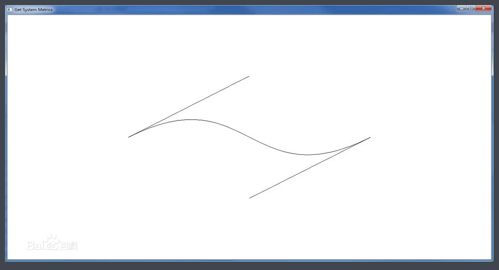

# 贝塞尔曲线

### PolyBezier

```
BOOL PolyBezier(HDC hdc, CONST POINT *lppt, DWORD cPoints);
```

● 参数

hdc：指定的设备环境句柄。

lppt：POINT结构[数组](https://baike.baidu.com/item/数组)的[指针](https://baike.baidu.com/item/指针)，包括了`样条端点和控制点的坐标，其顺序是起点的坐标、起点的控制点的坐标、终点的控制点的坐标和终点的坐标`。

cPoints：指明[数组](https://baike.baidu.com/item/数组)中的点的个数。

● 返回值

若[函数调用](https://baike.baidu.com/item/函数调用)成功，则返回非零，否则返回零。


### PolyBezierTo

```
BOOL PolyBezierTo(
HDChdc,
CONST POINT*lppt,
DWORD cCount
);
```

hdc ------------ Long，要在其中绘图的设备场景

lppt ----------- POINTAPI，指定一个POINTAPI结构[数组](https://baike.baidu.com/item/数组)。其中的第一个结构指定了起点。剩下的点三个一组——包括两个控件点和一个终点.

cCount---------- lppt[数组](https://baike.baidu.com/item/数组)的总点数 


```
//按下鼠标右键消息
WM_RBUTTONDOWN:
//按下鼠标左键消息
WM_LBUTTONDOWN:
//移动鼠标消息
WM_MOUSEMOVE:

wParam参数是按下了哪个键
```


```c
// 贝塞尔曲线.cpp : 定义应用程序的入口点。
//

#include "stdafx.h"
#include "贝塞尔曲线.h"

#define MAX_LOADSTRING 100

// 全局变量: 
HINSTANCE hInst;                                // 当前实例
WCHAR szTitle[MAX_LOADSTRING];                  // 标题栏文本
WCHAR szWindowClass[MAX_LOADSTRING];            // 主窗口类名

// 此代码模块中包含的函数的前向声明: 
ATOM                MyRegisterClass(HINSTANCE hInstance);
BOOL                InitInstance(HINSTANCE, int);
LRESULT CALLBACK    WndProc(HWND, UINT, WPARAM, LPARAM);
INT_PTR CALLBACK    About(HWND, UINT, WPARAM, LPARAM);

int APIENTRY wWinMain(_In_ HINSTANCE hInstance,
                     _In_opt_ HINSTANCE hPrevInstance,
                     _In_ LPWSTR    lpCmdLine,
                     _In_ int       nCmdShow)
{
    UNREFERENCED_PARAMETER(hPrevInstance);
    UNREFERENCED_PARAMETER(lpCmdLine);

    // TODO: 在此放置代码。

    // 初始化全局字符串
    LoadStringW(hInstance, IDS_APP_TITLE, szTitle, MAX_LOADSTRING);
    LoadStringW(hInstance, IDC_MY, szWindowClass, MAX_LOADSTRING);
    MyRegisterClass(hInstance);

    // 执行应用程序初始化: 
    if (!InitInstance (hInstance, nCmdShow))
    {
        return FALSE;
    }

    HACCEL hAccelTable = LoadAccelerators(hInstance, MAKEINTRESOURCE(IDC_MY));

    MSG msg;

    // 主消息循环: 
    while (GetMessage(&msg, nullptr, 0, 0))
    {
        if (!TranslateAccelerator(msg.hwnd, hAccelTable, &msg))
        {
            TranslateMessage(&msg);
            DispatchMessage(&msg);
        }
    }

    return (int) msg.wParam;
}


//
//  函数: MyRegisterClass()
//
//  目的: 注册窗口类。
//
ATOM MyRegisterClass(HINSTANCE hInstance)
{
    WNDCLASSEXW wcex;

    wcex.cbSize = sizeof(WNDCLASSEX);

    wcex.style          = CS_HREDRAW | CS_VREDRAW;
    wcex.lpfnWndProc    = WndProc;
    wcex.cbClsExtra     = 0;
    wcex.cbWndExtra     = 0;
    wcex.hInstance      = hInstance;
    wcex.hIcon          = LoadIcon(hInstance, MAKEINTRESOURCE(IDI_MY));
    wcex.hCursor        = LoadCursor(nullptr, IDC_ARROW);
    wcex.hbrBackground  = (HBRUSH)(COLOR_WINDOW+1);
    wcex.lpszMenuName   = MAKEINTRESOURCEW(IDC_MY);
    wcex.lpszClassName  = szWindowClass;
    wcex.hIconSm        = LoadIcon(wcex.hInstance, MAKEINTRESOURCE(IDI_SMALL));

    return RegisterClassExW(&wcex);
}

//
//   函数: InitInstance(HINSTANCE, int)
//
//   目的: 保存实例句柄并创建主窗口
//
//   注释: 
//
//        在此函数中，我们在全局变量中保存实例句柄并
//        创建和显示主程序窗口。
//
BOOL InitInstance(HINSTANCE hInstance, int nCmdShow)
{
   hInst = hInstance; // 将实例句柄存储在全局变量中

   HWND hWnd = CreateWindowW(szWindowClass, szTitle, WS_OVERLAPPEDWINDOW,
      CW_USEDEFAULT, 0, CW_USEDEFAULT, 0, nullptr, nullptr, hInstance, nullptr);

   if (!hWnd)
   {
      return FALSE;
   }

   ShowWindow(hWnd, nCmdShow);
   UpdateWindow(hWnd);

   return TRUE;
}

//
//  函数: WndProc(HWND, UINT, WPARAM, LPARAM)
//
//  目的:    处理主窗口的消息。
//
//  WM_COMMAND  - 处理应用程序菜单
//  WM_PAINT    - 绘制主窗口
//  WM_DESTROY  - 发送退出消息并返回
//
//

void DrawBezier(HDC hdc,POINT apt[]) {


	PolyBezier(hdc,apt,4);

	MoveToEx(hdc,apt[0].x, apt[0].y,NULL);
	LineTo(hdc, apt[1].x, apt[1].y);

	MoveToEx(hdc, apt[3].x, apt[3].y, NULL);
	LineTo(hdc, apt[2].x, apt[2].y);

}

void DrawBezier2(HDC hdc, POINT apt[]) {


	MoveToEx(hdc, apt[0].x, apt[0].y, NULL);
	PolyBezierTo(hdc, apt + 1, 3);

	MoveToEx(hdc, apt[0].x, apt[0].y, NULL);
	LineTo(hdc, apt[1].x, apt[1].y);

	MoveToEx(hdc, apt[3].x, apt[3].y, NULL);
	LineTo(hdc, apt[2].x, apt[2].y);

}

LRESULT CALLBACK WndProc(HWND hWnd, UINT message, WPARAM wParam, LPARAM lParam)
{
	static POINT apt[4];
	HDC hdc;
    switch (message)
    {
	
	case WM_RBUTTONDOWN:
	case WM_LBUTTONDOWN:
	case WM_MOUSEMOVE:
		if (wParam & MK_RBUTTON || wParam & MK_LBUTTON )
		{
			hdc = GetDC(hWnd);
            //用白色画笔还原
			SelectObject(hdc,GetStockObject(WHITE_PEN));
			DrawBezier(hdc, apt);
			//如果按下鼠标左键
			if (wParam & MK_LBUTTON) {
				apt[1].x = LOWORD(lParam);
				apt[1].y = HIWORD(lParam);
			}
            //如果按下鼠标右键
			if (wParam & MK_RBUTTON) {
				apt[2].x = LOWORD(lParam);
				apt[2].y = HIWORD(lParam);
			}
			//用黑色画笔画
			SelectObject(hdc, GetStockObject(BLACK_PEN));
			DrawBezier(hdc, apt);
			//DrawBezier2(hdc, apt);
			ReleaseDC(hWnd,hdc);
		}

	break;

	
	
	case WM_SIZE:
            //设置起点,起点控点,终点控点,终点
		apt[0].x = LOWORD(lParam) / 5;
		apt[0].y = HIWORD(lParam)/2;

		apt[1].x = 0;
		apt[1].y = 0;

		apt[2].x = LOWORD(lParam) * 4 / 5;
		apt[2].y = HIWORD(lParam)/2 - 200;

		apt[3].x = LOWORD(lParam) * 4/ 5;
		apt[3].y = HIWORD(lParam)/2;


		break;
    case WM_COMMAND:
        {
            int wmId = LOWORD(wParam);
            // 分析菜单选择: 
            switch (wmId)
            {
            case IDM_ABOUT:
                DialogBox(hInst, MAKEINTRESOURCE(IDD_ABOUTBOX), hWnd, About);
                break;
            case IDM_EXIT:
                DestroyWindow(hWnd);
                break;
            default:
                return DefWindowProc(hWnd, message, wParam, lParam);
            }
        }
        break;
    case WM_PAINT:
        {
            PAINTSTRUCT ps;
            HDC hdc = BeginPaint(hWnd, &ps);
            // TODO: 在此处添加使用 hdc 的任何绘图代码...
			DrawBezier(hdc,apt);
            EndPaint(hWnd, &ps);
        }
        break;
    case WM_DESTROY:
        PostQuitMessage(0);
        break;
    default:
        return DefWindowProc(hWnd, message, wParam, lParam);
    }
    return 0;
}

// “关于”框的消息处理程序。
INT_PTR CALLBACK About(HWND hDlg, UINT message, WPARAM wParam, LPARAM lParam)
{
    UNREFERENCED_PARAMETER(lParam);
    switch (message)
    {
    case WM_INITDIALOG:
        return (INT_PTR)TRUE;

    case WM_COMMAND:
        if (LOWORD(wParam) == IDOK || LOWORD(wParam) == IDCANCEL)
        {
            EndDialog(hDlg, LOWORD(wParam));
            return (INT_PTR)TRUE;
        }
        break;
    }
    return (INT_PTR)FALSE;
}

```


