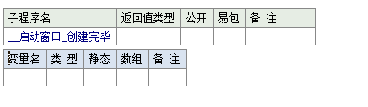
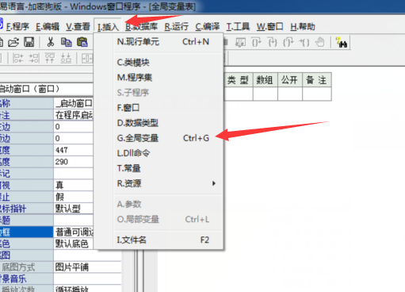
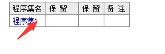

# 数据类型

什么是变量的数据类型呢?实际就是指变量内所存储的数据的类型。

下面我们来讲讲变量内所能存储的基本数据类型。

### 1.字节型。

可容纳0到255之间的数值。

### 2.短整数型。

可容纳-32,768到32,767之间的数值，尺寸为2个字节。

### 3.整数型。

可容纳-2,147 ,483,648到2,147,483,647之间的数值，尺寸为4个字节。

### 4.长整数型。

可容纳-9,223,372,036,854,775,808到

9,223,372,036,854,775,807之间的数值，尺寸为8个字节。

### 5.小数型。

可容纳3.4E +/- 38 (7位小数)之间的数值，尺寸为4个字节。

### 6.双精度小数型。

可容纳1.7E +/- 308 (15位小数)之间的数值，尺寸为8个字节。

### 7.逻辑型。

值只可能为“真"或“假”，尺寸为2个字节。“真"和“假"为系统预定义常量，其对应的英文常量名称为“true"和false".

### 8.日期时间型。

用作记录日期及时间，尺寸为8个字节。

### 9.文本型。

用作记录一段文本，文本由以字节0结束的一系列字符组成。

### 10.字节集。

用作记录一段字节型数据。 字节集与字节数组之间可以互相转换，在程序中允许使用字节数组的地方也可以使用字节集，或者相反。字节数组的使用方法，譬如用中括号对(“[]")加索引数值引用字节成员，使用数组型数值数据进行赋值等等，都可以被字节集所使用。两者之间唯一的不同是字节集可以变长，因此可把字节集看作可变长的字节数组。

### 11.子程序指针。

用作指向一个子程序，尺寸为4个字节。

在以上的基本数据类型中，字节型、短整数型、整数型、长整数型、小数型、双精度小数型被统称为“数值型”，它们之间可以任意转换。不过编程需要注意转换可能带来的精度丢失。譬如:将整数257转换为字节后的结果为1，这是因为值257超出了字节型数据的最大上限255,从而产生了溢出。查看变量所可以使用的数据类型，在定义变量中双击类型就可以查看所支持的所有数据类型。
 

# 创建变量

### 局部变量

快捷键: `ctrl + L`

子程序内有效

### 全局变量

快捷键:`ctrl +G`

整个程序有效

### 程序集变量

点击程序集1按下`回车键`

整个程序集有效

##### 变量可以先使用后声明

### 易语言规定用`[]`代表日期类型数据

`[年-月-日 时-分-秒]`

`[年:月:日 时:分:秒]`

[2020-1-1 11-11-22] 

[2020:1:1 11:11:22]

### 静态变量和非静态变量的区别

##### 静态变量

经过第一次初始化之后,后面就不用初始化了

子程序结束,变量不释放

##### 非静态变量

每次都会初始化

子程序结束,变量释放