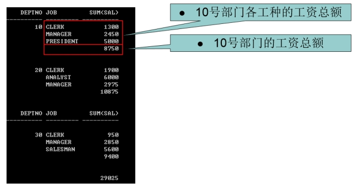

​	union 两个集合相同的部分保留一份
​	union all 两个集合相同的部分都保留
​	intersect 两个集合交集只保留相同的部分
​	minus  集合A-集合B，减去A和B都有的部分, 保留A中与B不同的部分
​	

	select * from emp where deptno = 10 union select * from emp where deptno=20;
	
	select * from emp where deptno = 10 union select * from emp where deptno in(20,10);
	
	select * from emp where deptno = 10 union all select * from emp where deptno in(20,10);
	
	select * from emp where deptno = 10 intersect select * from emp where deptno in(20,10);
	
	select * from emp where deptno in(10,30) minus  select * from emp where deptno in(20,10);
	
	总结: 使用集合运算要保证列数一样多, 前后的列的类型要一致
## **1.1** 集合运算需要注意的问题：

1. 参与运算的各个集合必须列数相同，且类型一致。		

2. 采用第一个集合的表头作为最终使用的表头。			(别名也只能在第一个集合上起)

3. 可以使用括号()先执行后面的语句。

 

问题：按照部门统计各部门不同工种的工资情况，要求按如下格式输出：

 

分析SQL执行结果。									 

​	第一部分数据是按照deptno和job进行分组；select 查询deptno、job、sum(sal)

​	第二部分数据是直接按照deptno分组即可，与job无关；select 只需要查询deptno，sum(sal)

​	第三部分数据不按照任何条件分组，即group by null；select 查询sum(sal)

 

所以，整体查询结果应该=  group by deptno，job  +  group by deptno  +  group by null

​	按照集合的要求,必须列数相同,类型一致,所以写法如下,使用null强行占位!

```
SQL> select deptno,job,sum(sal) from emp group by deptno,job
union
select deptno,to_char(null),sum(sal) from emp group by deptno
union
select to_number(null),to_char(null),sum(sal) from emp;	
```


需要注意:集合运算的性能一般较差.

### SQL的执行时间：

```
set timing on/off		默认是off 
```

